# Interview Preparation Resources

Everything you need to know to get the job

## Table of contents

* [C](#c)
* [C++](#c-1)
* [JAVA](#java)
* [Comparison of Inheritance in C++ and JAVA](#comparison-of-inheritance-in-c-and-java)
* [Data Structures](#data-structures)
* [OOPs](#oops)
* [DBMS](#dbms)
* [Computer Networking](#computer-networking)
* [Operating Systems](#operating-systems)
* [Compiler Design](#compiler-design)
* [System Design](#system-design)

## C

### Commonly Asked C Programming Interview Questions | Set 1

**What is the difference between declaration and definition of a
variable/function**\
**Ans:** Declaration of a variable/function simply declares that the
variable/function exists somewhere in the program but the memory is not
allocated for them. But the declaration of a variable/function serves an
important role. And that is the type of the variable/function.
Therefore, when a variable is declared, the program knows the data type
of that variable. In case of function declaration, the program knows
what are the arguments to that functions, their data types, the order of
arguments and the return type of the function. So that’s all about
declaration. Coming to the definition, when we define a
variable/function, apart from the role of declaration, it also allocates
memory for that variable/function. Therefore, we can think of definition
as a super set of declaration. (or declaration as a subset of
definition). From this explanation, it should be obvious that a
variable/function can be declared any number of times but it can be
defined only once. (Remember the basic principle that you can’t have two
locations of the same variable/function).

```cpp
// This is only declaration. y is not allocated memory by this statement

extern int y;

// This is both declaration and definition, memory to x is allocated by
this statement.

int x;
```

**What are different storage class specifiers in C?**\
**Ans:** auto, register, static, extern

**What is scope of a variable? How are variables scoped
in [*C*](http://www.geeksforgeeks.org/c/)?**\
**Ans:** Scope of a variable is the part of the program where the
variable may directly be accessible. In C, all identifiers are lexically
(or statically) scoped.
See [*this*](https://www.geeksforgeeks.org/scope-rules-in-c/) for more
details.

**What is the difference between Scope and Lifetime?** \
**Ans:**

***Scope*** is the region or section of code where a variable can be
accessed.

***Lifetime*** is the time duration where an object/variable is in a
valid state.

For, ***Automatic/Local non-static variables Lifetime is limited to
their Scope***.\
In other words, automatic variables are automagically destroyed once the
scope({,}) in which they are created ends. Hence the name automatic to
begin with.

**How will you print “Hello World” without semicolon?**\
**Ans:**

```cpp
  #include <stdio.h>
  
  int main(void)
  
  {
  
      if (printf("Hello World")) {
  
      }
  
  }
```

See [*print “Geeks for Geeks” without using a semicolon for
answer*](https://www.geeksforgeeks.org/write-a-c-program-to-print-geeks-for-geeks-without-using-a-semicolon/).

**When should we use pointers in a C program?**\
**1.** To get address of a variable\
**2.** For achieving pass by reference in C:*Pointers allow different
functions to share and modify their local variables.\
**3.** To pass large structures* so that complete copy of the structure
can be avoided.\
**4.** To implement “linked” data structures *like linked lists and
binary trees.

**How are variables scoped in C – Static or Dynamic?**

**Ans:** In C, variables are always [*statically (or lexically)
scoped*](http://en.wikipedia.org/wiki/Scope_%28programming%29#Lexical_scoping) i.e.,
binding of a variable can be determined by program text and is
independent of the run-time function call stack.

For example, output for the below program is 0, i.e., the value returned
by f() is not dependent on who is calling it. f() always returns the
value of global variable x.

  ```cpp
  #include <stdio.h>

  int x = 0;
  
  int f()  
  {
     return x;
  }
  
  int g()
  {
     int x = 1;
     return f();
  }
  
  int main()
  {
    printf("%d", g());
    printf("\\n");
    getchar();
  }
  ```

**What is NULL pointer?**\
**Ans:** NULL is used to indicate that the pointer doesn’t point to a
valid location. Ideally, we should initialize pointers as NULL if we
don’t know their value at the time of declaration. Also, we should make
a pointer NULL when memory pointed by it is deallocated in the middle of
a program.

**What is Dangling pointer?**\
**Ans:** Dangling Pointer is a pointer that doesn’t point to a valid
memory location. Dangling pointers arise when an object is deleted or
deallocated, without modifying the value of the pointer, so that the
pointer still points to the memory location of the deallocated memory.
Following are examples.

```cpp
  // EXAMPLE 1
  
  int* ptr = (int*)malloc(sizeof(int));
  
  free(ptr);
  
  // ptr is a dangling pointer now and operations like following are invalid
  
  *ptr = 10; // or printf("%d", *ptr);
  
  // EXAMPLE 2
  
  int* ptr = NULL
  {
      int x = 10;
      ptr = &x;
  }
  
  // x goes out of scope and memory allocated to x is free now.
  
  // So ptr is a dangling pointer now.
  ```

**What is memory leak? Why it should be avoided**\
**Ans:** Memory leak occurs when programmers create a memory in heap and
forget to delete it. Memory leaks are particularly serious issues for
programs like daemons and servers which by definition never terminate.

  ```cpp
  //Function with memory leak
  
  #include <stdlib.h>
  
  void f()
  {
      int* ptr = (int*)malloc(sizeof(int));
  

  
      /* Do some work */
  

  
      return; /* Return without freeing ptr*/
  
  }
  ```

**What are local static variables? What is their use?**\
**Ans:** A local static variable is a variable whose lifetime doesn’t end
with a function call where it is declared. It extends for the lifetime
of complete program. All calls to the function share the same copy of
local static variables. Static variables can be used to count the number
of times a function is called. Also, static variables get the default
value as 0. For example, the following program prints “0 1”

  ```cpp
  #include <stdio.h>
  
  void fun()
  
  {
  
      // static variables get the default value as 0.
  
      static int x;
  
      printf("%d ", x);
  
      x = x + 1;
  
  }
  

  
  int main()
  
  {
  
      fun();
  
      fun();
  
      return 0;
  
  }
  
  // Output: 0 1
  ```

**What are static functions? What is their use?**\
**Ans:**

In C, functions are global by default. The “*static*” keyword before a
function name makes it static. For example, below function *fun()* is
static.

  ```cpp
  static int fun(void)
  
  {
  
    printf("I am a static function ");
  
  }
  ```

Unlike global functions in C, access to static functions is restricted
to the file where they are declared. Therefore, when we want to restrict
access to functions, we make them static. Another reason for making
functions static can be reuse of the same function name in other files.

For example, if we store following program in one file *file1.c*

  ```cpp
  /* Inside file1.c */
  
  static void fun1(void)
  
  {
  
    puts("fun1 called");
  
  }
  ```

And store following program in another file *file2.c*

  ```cpp
  /* Iinside file2.c  */
  
  int main(void)
  
  {
  
    fun1();
  
    getchar();
  
    return 0;  
  
  }
  ```

Now, if we compile the above code with command “*gcc file2.c file1.c*”,
we get the error *“undefined reference to \`fun1’”* . This is
because *fun1()* is declared *static* in *file1.c* and cannot be used
in *file2.c*.

**What are main characteristics of C language?**\
C is a procedural language. The main features of C language include
low-level access to memory, simple set of keywords, and clean style.
These features make it suitable for system programming like operating
system or compiler development.

**What is difference between i++ and ++i?**

1) The expression ‘i++’ returns the old value and then increments i. The
expression ++i increments the value and returns new value.
2) Precedence of postfix ++ is higher than that of prefix ++.
3) Associativity of postfix ++ is left to right and associativity of
prefix ++ is right to left.
4) In C++, ++i can be used as l-value, but i++ cannot be. In C, they
both cannot be used as l-value.
See [Difference between ++*p, *p++ and
*++p](https://www.geeksforgeeks.org/difference-between-p-p-and-p/) for
more details.

**What is l-value?**\
l-value or location value refers to an expression that can be used on
left side of assignment operator. For example in expression “a = 3”, a
is l-value and 3 is r-value.\
l-values are of two types:\
“nonmodifiable l-value” represent a l-value that can not be modified.
const variables are “nonmodifiable l-value”.\
“modifiable l-value” represent a l-value that can be modified.

Refer [lvalue and rvalue in C
language](https://www.geeksforgeeks.org/lvalue-and-rvalue-in-c-language/)for
details.

**What is the difference between array and pointer?**\
See [Array vs
Pointer](https://www.geeksforgeeks.org/difference-pointer-array-c/)

**How to write your own sizeof operator?**

  ```cpp
  #define my_sizeof(type) (char *)(&type+1)-(char*)(&type)
  ```

See [Implement your own
sizeof](https://www.geeksforgeeks.org/implement-your-own-sizeof/) for
more details.

**How will you print numbers from 1 to 100 without using loop?**\
We can use recursion for this purpose.

  ```cpp
  /* Prints numbers from 1 to n */
  
  void printNos(unsigned int n)
  
  {
  
    if(n > 0)
  
    {
  
      printNos(n-1);
  
      printf("%d ",  n);
  
    }
  
  }
  ```

**What is volatile keyword?**\
The volatile keyword is intended to prevent the compiler from applying
any optimizations on objects that can change in ways that cannot be
determined by the compiler.\
Objects declared as volatile are omitted from optimization because their
values can be changed by code outside the scope of current code at any
time. See [Understanding “volatile” qualifier in
C](https://www.geeksforgeeks.org/understanding-volatile-qualifier-in-c/)
for more details.

**Can a variable be both const and volatile?**\
yes, the const means that the variable cannot be assigned a new value.
The value can be changed by other code or pointer. For example the
following program works fine.

  ```cpp
  int main(void)
  
  {
  
      const volatile int local = 10;
  
      int *ptr = (int*) &local;
  
      printf("Initial value of local : %d \\n", local);
  
      *ptr = 100;
  
      printf("Modified value of local: %d \\n", local);
  
      return 0;
  
  }
  ```

## C++

## Commonly Asked C++ Interview Questions | Set 1

**What are the differences between C and C++?**\
**1)** C++ is a kind of superset of C, most of C programs except few
exceptions (See [*this*](https://www.geeksforgeeks.org/write-c-program-produce-different-result-c/) and [*this*](https://www.geeksforgeeks.org/write-c-program-wont-compiler-c/))
work in C++ as well.\
**2)** C is a procedural programming language, but C++ supports both
procedural and Object Oriented programming.\
**3)** Since C++ supports object oriented programming, it supports
features like function overloading, templates, inheritance, virtual
functions, friend functions. These features are absent in C.\
**4)** C++ supports exception handling at language level, in C exception
handling is done in traditional if-else style.\
**5)** C++
supports [*references*](https://www.geeksforgeeks.org/references-in-c/), C
doesn’t.\
**6)** In C, scanf() and printf() are mainly used input/output. C++
mainly uses streams to perform input and output operations. cin is
standard input stream and cout is standard output stream.

There are many more differences, above is a list of main differences.

**What are the differences between references and pointers?**\
Both references and pointers can be used to change local variables of
one function inside another function. Both of them can also be used to
save copying of big objects when passed as arguments to functions or
returned from functions, to get efficiency gain.\
Despite above similarities, there are following differences between
references and pointers.

*References are less powerful than pointers*
1) Once a reference is created, it cannot be later made to reference
another object; it cannot be reseated. This is often done with
pointers.
2) References cannot be NULL. Pointers are often made NULL to indicate
that they are not pointing to any valid thing.
3) A reference must be initialized when declared. There is no such
restriction with pointers

Due to the above limitations, references in C++ cannot be used for
implementing data structures like Linked List, Tree, etc. In Java,
references don’t have above restrictions, and can be used to implement
all data structures. References being more powerful in Java, is the main
reason Java doesn’t need pointers.

*References are safer and easier to use:*
1) Safer: Since references must be initialized, wild references like
wild pointers are unlikely to exist. It is still possible to have
references that don’t refer to a valid location (See questions 5 and 6
in the below exercise )
2) Easier to use: References don’t need dereferencing operator to access
the value. They can be used like normal variables. ‘&’ operator is
needed only at the time of declaration. Also, members of an object
reference can be accessed with dot operator (‘.’), unlike pointers where
arrow operator (->) is needed to access members.

**What are virtual functions – Write an example?**\
[*Virtual
functions*](https://www.geeksforgeeks.org/virtual-functions-and-runtime-polymorphism-in-c-set-1-introduction/) are
used with inheritance, they are called according to the type of object
pointed or referred, not according to the type of pointer or reference.
In other words, virtual functions are resolved late, at runtime. Virtual
keyword is used to make a function virtual.

Following things are necessary to write a C++ program with runtime
polymorphism (use of virtual functions)
1) A base class and a derived class.
2) A function with same name in base class and derived class.
3) A pointer or reference of base class type pointing or referring to an
object of derived class.

For example, in the following program bp is a pointer of type Base, but
a call to bp->show() calls show() function of Derived class, because
bp points to an object of Derived class.

  ```cpp
  #include<iostream>
  using namespace std;
  
  class Base {
  
  public:
      virtual void show() { cout<<" In Base \\n"; }

  }
    
  class Derived: public Base {
  
  public:
      void show() { cout<<"In Derived \\n"; } 
  
  };
  
  int main(void) {   
  
      Base *bp = new Derived;     
      bp->show();  // RUN-TIME POLYMORPHISM
      return 0;
  
  }
  ```

Output:

In Derived

**What is this pointer?**\
The [*‘this’
pointer*](https://www.geeksforgeeks.org/this-pointer-in-c/) is passed as
a hidden argument to all nonstatic member function calls and is
available as a local variable within the body of all nonstatic
functions. ‘this’ pointer is a constant pointer that holds the memory
address of the current object. ‘this’ pointer is not available in static
member functions as static member functions can be called without any
object (with class name).

**Can we do “delete this”?**

Ideally *delete* operator should not be used for *this* pointer.
However, if used, then following points must be considered.

1) *delete* operator works only for objects allocated using
operator *new* (See [this
post](https://www.geeksforgeeks.org/g-fact-30/)). If the object is
created using new, then we can do *delete this*, otherwise behavior is
undefined.

  ```cpp
  class A
  
  {
  
    public:
  
      void fun()
  
      {
  
          delete this;
  
      }
  
  };
  
    
  
  int main()
  
  {
  
    /* Following is Valid */
  
    A *ptr = new A;
  
    ptr->fun();
  
    ptr = NULL; // make ptr NULL to make sure that things are not accessed using ptr. 
  
    
  
    
  
    /* And following is Invalid: Undefined Behavior */
  
    A a;
  
    a.fun();
  
    
  
    getchar();
  
    return 0;
  
  }
  ```

2\) Once *delete this* is done, any member of the deleted object should
not be accessed after deletion.

  ```cpp
  #include<iostream>
  
  using namespace std;
  
    
  
  class A
  
  {
  
    int x;
  
    public:
  
      A() { x = 0;}
  
      void fun() {
  
        delete this;
  
    
  
        /* Invalid: Undefined Behavior */
  
        cout<<x;
  
      }
  
  };
  ```

**What are VTABLE and VPTR?**\
vtable is a table of function pointers. It is maintained per class.\
vptr is a pointer to vtable. It is maintained per object\
Compiler adds additional code at two places to maintain and use vtable
and vptr.
1) Code in every constructor. This code sets vptr of the object being
created. This code sets vptr to point to vtable of the class.
2) Code with polymorphic function call (e.g. bp->show() in above
code). Wherever a polymorphic call is made, compiler inserts code to
first look for vptr using base class pointer or reference (In the above
example, since pointed or referred object is of derived type, vptr of
derived class is accessed). Once vptr is fetched, vtable of derived
class can be accessed. Using vtable, address of derived derived class
function show() is accessed and called.
```cpp
#include<iostream.h>

class Base
{

public:

virtual void function1() {cout<<"Base :: function1()\n";};

virtual void function2() {cout<<"Base :: function2()\n";};

virtual ~Base(){};

};

class D1: public Base
{

public:
~D1(){};
virtual void function1() { cout<<"D1 :: function1()\n";};

};

class D2: public Base
{

public:
~D2(){};
virtual void function2() { cout<< "D2 :: function2\n";};

};

int main()
{

D1 *d = new D1;;
Base *b = d;
b->function1();
b->function2();
delete (b);
return (0);

}
```
**Output**:

D1 :: function1() // base virtual member function got overloaded

// If virtual is removed then: Base :: function1()

Base :: function2()

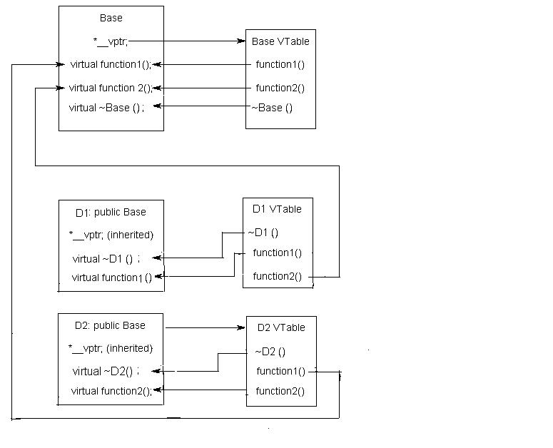


## Commonly Asked C++ Interview Questions | Set 2

### Q. Major Differences between JAVA and C++ 

There are lot of differences, some of the major differences are:

-   Java has automatic garbage collection whereas C++ has destructors, which are automatically invoked when the object is destroyed.

-   Java does not support pointers, templates, unions, operator overloading, structures etc.

-   C++ has no in built support for threads, whereas in Java there is a Thread class that you inherit to create a new thread

-   No goto in JAVA

-   C++ support multiple inheritance, method overloading and operator overloading but JAVA only has method overloading.

-   Java is *interpreted* and hence platform independent whereas C++ isn’t. At compilation time, Java Source code converts into JVM *byte code*. The interpreter executes this bytecode at run time and gives output. C++ run and compile using compiler which converts source code into machine level language.

### 

### Q. What are C++ access specifiers ?

Access specifiers are used to define how the members (functions and
variables) can be accessed outside the class.

-   **Private:** Members declared as private are accessible only within
      the same class and they cannot be accessed outside the class they
      are declared. Child classes are also not allowed to access private
      members of parent.

-   **Public:** Members declared as public are accessible from anywhere.

-   **Protected:** Only the class and its child classes can access
      protected
      members.

Do you know [*What happens when more restrictive access is given to a
derived class method in
C++?*](https://www.geeksforgeeks.org/what-happens-when-more-restrictive-access-is-given-in-a-derived-class-method-in-c/)

###  

### Q. Major C++ features

**Class:** Class is a blueprint of data and functions or methods. Class
does not take any space.

-   **Object:** Objects are basic run-time entities in an object
      oriented system, objects are instances of a class these are
      defined user defined data types.

-   **Encapsulation and Data abstraction:** Wrapping up(combining) of
      data and functions into a single unit is known as encapsulation.
      The data is not accessible to the outside world and only those
      functions which are wrapping in the class can access it. This
      insulation of the data from direct access by the program is called
      data hiding or information hiding.

-   **Data abstraction** – providing only needed information to the
      outside world and hiding implementation details. For example,
      consider a class Complex with public functions as getReal() and
      getImag(). We may implement the class as an array of size 2 or as
      two variables. The advantage of abstractions is, we can change
      implementation at any point, users of Complex class wont’t be
      affected as our method interface remains same. Had our
      implementation be public, we would not have been able to change
      it.

-   **Inheritance:** Inheritance is the process by which objects of one
      class acquire the properties of objects of another class. It
      supports the concept of hierarchical classification. Inheritance
      provides reusability. This means that we can add additional
      features to an existing class without modifying it.

-   **Polymorphism:** Polymorphism means ability to take more than one
      form. An operation may exhibit different behaviors in different
      instances. The behavior depends upon the types of data used in the
      operation.

-   **Dynamic Binding:** In dynamic binding, the code to be executed in
      response to function call is decided at runtime. C++ has virtual
      functions to support this.

-   **Message Passing:** Objects communicate with one another by sending
      and receiving information to each other. A message for an object
      is a request for execution of a procedure and therefore will
      invoke a function in the receiving object that generates the
      desired results. Message passing involves specifying the name of
      the object, the name of the function and the information to be
      sent.

### 

### Q. [Structure vs class in C++](https://www.geeksforgeeks.org/g-fact-76/)

-   In C++, a structure is same as class except the following differences:

    -   Members of a class are private by default and members of struct are public by default.

    -   When deriving a struct from a class/struct, default access-specifier for a base class/struct is public. And when deriving a class, default access specifier is private.

### 

### Q. [*Malloc() vs new*](https://www.geeksforgeeks.org/malloc-vs-new/) / [*Delete vs Free*](https://www.geeksforgeeks.org/g-fact-30/)

Following are the differences between malloc() and operator new.

-   new is an operator, while malloc() is a function.

-   new returns exact data type, while malloc() returns void *.

-   new calls constructors( class instances are initalized and deinitialized automatically), while malloc() does not (classes won’t get initalized or deinitialized automatically)

-   Syntax:
```c
    1.  int *n = new int(10); // initialization with new()

    2.  str = (char *) malloc(15); //malloc()
```
**free( )** is used on resources allocated by malloc( ), or calloc( ) in
C

**Delete** is used on resources allocated by new in C++

### 

### Q. [*Inline Functions*](http://quiz.geeksforgeeks.org/inline-functions-cpp/)

C++ provides an inline functions to reduce the function call overhead.
Inline function is a function that is expanded in line when it is
called. When the inline function is called whole code of the inline
function gets inserted or substituted at the point of inline function
call. This substitution is performed by the C++ compiler at compile
time. Inline function may increase efficiency if it is small.

The syntax for defining the function inline is:
```cpp
inline return-type function-name(parameters)

{

// function code

}
```
*Remember, inlining is only a request to the compiler, not a command.
Compiler can ignore the request for inlining.*


###  Q.[*Friend class and function in C++*](http://quiz.geeksforgeeks.org/friend-class-function-cpp/)

A friend class can access private and protected members of other class
in which it is declared as friend. It is sometimes useful to allow a
particular class to access private members of other class. For example a
LinkedList class may be allowed to access private members of Node.

Friend Function Like friend class, a friend function can be given
special grant to access private and protected members. A friend function
can be:

a\) A method of another class

b\) A global function

**Important points about friend functions and classes:**

1\) Friends should be used only for limited purpose. too many functions
or external classes are declared as friends of a class with protected or
private data, it lessens the value of encapsulation of separate classes
in object-oriented programming.

2\) Friendship is not mutual. If a class A is friend of B, then B doesn’t
become friend of A automatically.

3\) Friendship is not inherited (See this for more details)

4\) The concept of friends is not there in Java.

### 

### Q. [*Function overloading*](https://www.geeksforgeeks.org/function-overloading-in-c/) VS [*Operator Overloading*](http://quiz.geeksforgeeks.org/operator-overloading-c/)

Function overloading is a feature in C++ where two or more functions can
have the same name but different type of parameters and  different
number of parameters.

*Note: Overloading of functions with different return types are not
allowed.*

Operating overloading allows us to  make operators to work for user
defined classes. For example, we can overload an operator ‘+’ in a class
like String so that we can concatenate two strings by just using +.

Other example classes where arithmetic operators may be overloaded are
Complex Number, Fractional Number, Big Integer, etc.

  ```cpp
  class Complex {
  private:
  int real, imag;
  public:
  Complex(int r = 0, int i =0) {real = r; imag = i;}
  
  // This is automatically called when '+' is used with
  // between two Complex objects
  Complex operator + (Complex const &obj) {
  Complex res;
  res.real = real + obj.real;
  res.imag = imag + obj.imag;
  return res;
  }
  void print() { cout << real << " + i" << imag << endl; }
  };
  
  int main()
  {
  Complex c1(10, 5), c2(2, 4);
  Complex c3 = c1 + c2; // An example call to "operator+"
  c3.print();
  }
  ```

### 

### Q. [*Copy Constructor*](http://quiz.geeksforgeeks.org/copy-constructor-in-cpp/)

A copy constructor is a member function which initializes an object
using another object of the same class. A copy constructor has the
following general function prototype: 
```cpp
ClassName (const ClassName &old\_obj);

Point(int x1, int y1) { x = x1; y = y1; }

// Copy constructor

Point(const Point &p2) {x = p2.x; y = p2.y; }
```
**When is copy constructor called?**

In C++, a Copy Constructor may be called in following cases:

1.  When an object of the class is returned by value.

2.  When an object of the class is passed (to a function) by value as an argument.

3.  When an object is constructed based on another object of the same class.

4.  When compiler generates a temporary object.

***Can we make copy constructor private?***

*Yes, a copy constructor can be made private*

###  

### Q.What Is Inheritance?

Different kinds of objects often have a certain amount in common with
each other. Yet each also defines additional features that make them
different. Object-oriented programming allows classes to inherit
commonly used state and behavior from other classes

### 

### Q. What is Static Member?

Static is a keyword in C++ used to give special characteristics to an
element. Static elements are allocated storage only once in a program
lifetime in static storage area. And they have a scope till the program
lifetime. Static Keyword can be used with following,

[***Interesting facts about Static Members Functions  in
C++***](https://www.geeksforgeeks.org/some-interesting-facts-about-static-member-functions-in-c/)

-   static member functions do not have this pointer.

-   A static member function cannot be virtual

-   Member function declarations with the same name and the name parameter-type-list cannot be overloaded if any of them is a static member function declaration.

-   static member function can not be declared const, volatile, or const volatile.

**What is a namespace?**

In each scope, a name can only represent one entity. So, there cannot be
two variables with the same name in the same scope. Using namespaces, we
can create two variables or member functions having the same name.

A namespace definition begins with the keyword **namespace** followed by
the namespace name as follows:
```cpp
namespace namespace\_name

{

int x, y; // code declarations where

// x and y are declared in

// namespace\_name's scope

}
```
# Memory Layout of C Programs

A typical memory representation of C program consists of the following
sections.

1\. Text segment

2\. Initialized data segment

3\. Uninitialized data segment

4\. Stack

5\. Heap

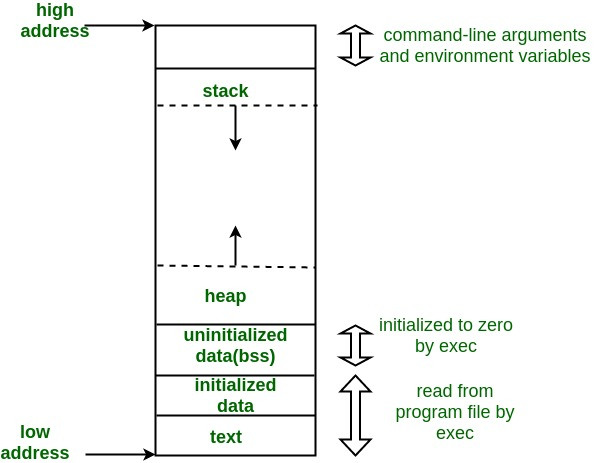

A typical memory layout of a running process

**1. Text Segment:**

A text segment , also known as a code segment or simply as text, is one
of the sections of a program in an object file or in memory, which
contains executable instructions.

As a memory region, a text segment may be placed below the heap or stack
in order to prevent heaps and stack overflows from overwriting it.

Usually, the text segment is sharable so that only a single copy needs
to be in memory for frequently executed programs, such as text editors,
the C compiler, the shells, and so on. Also, the text segment is often
read-only, to prevent a program from accidentally modifying its
instructions.

**2. Initialized Data Segment:**

Initialized data segment, usually called simply the Data Segment. A data
segment is a portion of virtual address space of a program, which
contains the global variables and static variables that are initialized
by the programmer.

Note that data segment is not read-only, since the values of the
variables can be altered at run time.

This segment can be further classified into initialized read-only area
and initialized read-write area.

For instance the global string defined by char s\[\] = “hello world” in
C and a C statement like int debug=1 outside the main (i.e. global)
would be stored in initialized read-write area. And a global C statement
like const char* string = “hello world” makes the string literal “hello
world” to be stored in initialized read-only area and the character
pointer variable string in initialized read-write area.

Ex: static int i = 10 will be stored in data segment and global int i =
10 will also be stored in data segment

**3. Uninitialized Data Segment:**

Uninitialized data segment, often called the “bss” segment, named after
an ancient assembler operator that stood for “block started by symbol.”
Data in this segment is initialized by the kernel to arithmetic 0 before
the program starts executing

uninitialized data starts at the end of the data segment and contains
all global variables and static variables that are initialized to zero
or do not have explicit initialization in source code.

For instance a variable declared static int i; would be contained in the
BSS segment.

For instance a global variable declared int j; would be contained in the
BSS segment.

**4. Stack:**

The stack area traditionally adjoined the heap area and grew the
opposite direction; when the stack pointer met the heap pointer, free
memory was exhausted. (With modern large address spaces and virtual
memory techniques they may be placed almost anywhere, but they still
typically grow opposite directions.)

The stack area contains the program stack, a LIFO structure, typically
located in the higher parts of memory. On the standard PC x86 computer
architecture it grows toward address zero; on some other architectures
it grows the opposite direction. A “stack pointer” register tracks the
top of the stack; it is adjusted each time a value is “pushed” onto the
stack. The set of values pushed for one function call is termed a “stack
frame”; A stack frame consists at minimum of a return address.

Stack, where automatic variables are stored, along with information that
is saved each time a function is called. Each time a function is called,
the address of where to return to and certain information about the
caller’s environment, such as some of the machine registers, are saved
on the stack. The newly called function then allocates room on the stack
for its automatic and temporary variables. This is how recursive
functions in C can work. Each time a recursive function calls itself, a
new stack frame is used, so one set of variables doesn’t interfere with
the variables from another instance of the function.

**5. Heap:**

Heap is the segment where dynamic memory allocation usually takes place.

The heap area begins at the end of the BSS segment and grows to larger
addresses from there.The Heap area is managed by malloc, realloc, and
free, which may use the brk and sbrk system calls to adjust its size
(note that the use of brk/sbrk and a single “heap area” is not required
to fulfill the contract of malloc/realloc/free; they may also be
implemented using mmap to reserve potentially non-contiguous regions of
virtual memory into the process’ virtual address space). The Heap area
is shared by all shared libraries and dynamically loaded modules in a
process.

## JAVA

**Why is Java called the ‘Platform Independent Programming Language’?**
 

Platform independence means that execution of your program does not
dependent on type of operating system(it could be any : Linux, windows,
Mac ..etc). So compile code only once and run it on any System (In
C/C++, we need to compile the code for every machine on which we run
it). Java is both compiler(javac) and interpreter(jvm) based lauguage.
Your java source code is first compiled into byte code using javac
compiler. This byte code can be easily converted to equivalent machine
code using JVM. JVM(Java Virtual Machine) is available in all operating
systems we install. Hence, byte code generated by javac is universal and
can be converted to machine code on any operating system, this is the
reason why java is platform independent.

 \
**Explain Final keyword in java?**
 

Final keyword in java is used to restrict usage of variable, class and
method.\
 \
Variable: Value of Final variable is constant, you cannot change it.\
Method: you can’t override a Final method.\
Class: you can’t inherit from Final class.

**When is the super keyword used?**\
 \
super keyword is used to refer:

-   immediate parent class constructor,

-   immediate parent class variable,

-   immediate parent class method.

Refer [this](http://quiz.geeksforgeeks.org/super-keyword/) for details.

 \
**What is the difference between StringBuffer and String?**\
 

String is an Immutable class, i.e. you can not modify its content once
created. While StringBuffer is a mutable class, means you can change its
content later. Whenever we alter content of String object, it creates a
new string and refer to that,it does not modify the existing one. This
is the reason that the performance with StringBuffer is better than with
String.\
Refer [this](https://www.geeksforgeeks.org/g-fact-27-string-vs-stringbuilder-vs-stringbuffer/) for
details.

 \
**Why multiple inheritance is not supported in java?**\
 

Java supports multiple inheritance but not through classes, it supports
only through its interfaces. The reason for not supporting multiple
inheritance is to avoid the conflict and complexity arises due to it and
keep Java a Simple Object Oriented Language. If we recall [this in
C++](https://www.geeksforgeeks.org/multiple-inheritance-in-c/), there is
a special case of multiple inheritance (diamond problem) where you have
a multiple inheritance with two classes which have methods in conflicts.
So, Java developers decided to avoid such conflicts and didn’t allow
multiple inheritance through classes at all.

 \
**Can a top level class be private or protected?**\
 

Top level classes in java can’t be private or protected, but inner
classes in java can. The reason for not making a top level class as
private is very obvious, because nobody can see a private class and thus
they can not use it. Declaring a class as protected also doesn’t make
any sense. The only difference between default visibility and protected
visibility is that we can use it in any package by inheriting it. Since
in java there is no such concept of package inheritance, defining a
class as protected is no different from default.

 \
**What is the difference between ‘throw’ and ‘throws’ in Java Exception
Handling?**\
 

Following are the differences between two:

-   throw keyword is used to throw Exception from any method or static
      block whereas throws is used to indicate that which Exception can
      possibly be thrown by this method

-   If any method throws checked Exception, then caller can either
      handle this exception(using try catch block )or can re throw it by
      declaring another ‘throws’ clause in method declaration.

-   throw clause can be used in any part of code where you feel a
      specific exception needs to be thrown to the calling method

E.g.\
**throw**\
throw new Exception(“You have some exception”)\
throw new IOException(“Connection failed!!”)\
**throws**\
throws IOException, NullPointerException, ArithmeticException

 \
**What is finalize() method?**\
 \
Unlike c++ , we don’t need to destroy objects explicitly in Java.
‘[Garbage
Collector](https://www.geeksforgeeks.org/garbage-collection-java/)‘ does
that automatically for us. Garbage Collector checks if no references to
an object exist, that object is assumed to be no longer required, and
the memory occupied by the object can be freed. Sometimes an object can
hold non-java resources such as file handle or database connection, then
you want to make sure these resources are also released before object is
destroyed. To perform such operation Java provide protected void
finalize() in object class. You can override this method in your class
and do the required tasks. Right before an object is freed, the java run
time calls the finalize() method on that object.
Refer [this](https://www.geeksforgeeks.org/garbage-collection-java/) for
more details.

 \
**Difference in Set and List interface?**\
 

Set and List both are child interface of Collection interface. There are
following two main differences between them

-   List can hold duplicate values but Set doesn’t allow this.

-   In List interface data is present in the order you inserted but in
      the case of Set insertion order is not preserved.

 \
**What will happen if you put System.exit(0) on try or catch block? Will
finally block execute?**\
 \
By Calling System.exit(0) in try or catch block, we can skip the finally
block. System.exit(int) method can throw a SecurityException. If
Sysytem.exit(0) exits the JVM without throwing that exception then
finally block will not execute. But, if System.exit(0) does throw
security exception then finally block will be executed.

**Can we [Overload or Override static methods in
java](https://www.geeksforgeeks.org/can-we-overload-or-override-static-methods-in-java/) ?**

-   **Overriding :** Overriding is related to run-time polymorphism. A
      subclass (or derived class) provides a specific implementation of
      a method in superclass (or base class) at runtime.

-   **Overloading:** Overloading is related to compile time (or static)
      polymorphism. This feature allows different methods to have same
      name, but different signatures, especially number of input
      parameters and type of input paramaters.

-   **Can we overload static methods?** The answer is **‘Yes’**. We
      can have two ore more static methods with same name, but
      differences in input parameters

-   **Can we Override static methods in java?** We can declare static
      methods with same signature in subclass, but it is not considered
      overriding as there won’t be any run-time polymorphism. Hence the
      answer is **‘No’**. Static methods cannot be overridden because
      method overriding only occurs in the context of dynamic (i.e.
      runtime) lookup of methods. Static methods (by their name) are
      looked up statically (i.e. at compile-time).

Read [more](https://www.geeksforgeeks.org/can-we-overload-or-override-static-methods-in-java/)

 

**Why the main method is static in java?**\
The method is static because otherwise there would be ambiguity: which
constructor should be called? Especially if your class looks like this:
```java
public class JavaClass

{

protected JavaClass(int x)

{ }

public void main(String\[\] args)

{

}

}
```
Should the JVM call new JavaClass(int)? What should it pass for x? If
not, should the JVM instantiate JavaClass without running any
constructor method? because that will special-case your entire class –
sometimes you have an instance that hasn’t been initialized, and you
have to check for it in every method that could be called. There are
just too many edge cases and ambiguities for it to make sense for the
JVM to have to instantiate a class before the entry point is called.
That’s why main is static.

 

**What happens if you remove static modifier from the main method?**\
Program compiles successfully . But at runtime throws an error
“NoSuchMethodError”.

 

**What is the [scope of
variables](https://www.geeksforgeeks.org/variable-scope-in-java/) in
Java in following cases?**

-   **Member Variables** (Class Level Scope) : The member variables must
      be declared inside class (outside any function). They can be
      directly accessed anywhere in class

-   **Local Variables**(Method Level Scope) : Variables declared inside
      a method have method level scope and can’t be accessed outside the
      method.

-   **Loop Variables**(Block Scope) : A variable declared inside pair
      of brackets “{” and “}” in a method has scope withing the brackets
      only.

Read [more](https://www.geeksforgeeks.org/variable-scope-in-java/)

 

**What is[ “this” keyword in
java](http://quiz.geeksforgeeks.org/this-reference-in-java/)?**\
Within an instance method or a constructor, this is a reference to the
current object — the object whose method or constructor is being called.
You can refer to any member of the current object from within an
instance method or a constructor by using this.\
Usage of this keyword

-   Used to refer current class instance variable.

-   To invoke current class constructor.

-   It can be passed as an argument in the method call.

-   It can be passed as argument in the constructor call.

-   Used to return the current class instance.

-   Used to invoke current class method (implicitly)

 

**What is an [abstract
class](https://www.geeksforgeeks.org/abstract-classes-in-java/)? How
abstract classes are similar or different in Java from C++?**\
Abstract classes are classes that contain one or more abstract methods.
An abstract method is a method that is declared, but contains no
implementation. Abstract classes may not be instantiated, and require
subclasses to provide implementations for the abstract methods.

-   Like C++, in Java, an instance of an abstract class cannot be
      created, we can have references of abstract class type though.

-   Like C++, an abstract class can contain constructors in Java. And a
      constructor of abstract class is called when an instance of a
      inherited class is created

-   In Java, we can have an abstract class without any abstract method.
      This allows us to create classes that cannot be instantiated, but
      can only be inherited.

-   Abstract classes can also have final methods (methods that cannot be
      overridden). For example, the following program compiles and runs
      fine.

Read [more](https://www.geeksforgeeks.org/abstract-classes-in-java/)

 

**Abstract class vs Interface**

-   **Type of methods:** Interface can have only abstract methods.
     Abstract class can have abstract and non-abstract methods. From
     Java 8, it can have default and static methods also.

-   **Final Variables:** Variables declared in a Java interface are by
    default final. An abstract class may contain non-final variables.

-   **Type of variables:** Abstract class can have final, non-final,
    static and non-static variables. Interface has only static and
    final variables.

-   **Implementation:** Abstract class can provide the implementation of
    interface. Interface can’t provide the implementation of abstract
    class.

-   **Inheritance vs Abstraction:** A Java interface can be implemented
    using keyword “implements” and abstract class can be extended
    using keyword “extends”.

-   **Multiple implementation:** An interface can extend another Java
    interface only, an abstract class can extend another Java class
    and implement multiple Java interfaces.

-   **Accessibility of Data Members:** Members of a Java interface are
    public by default. A Java abstract class can have class members
    like private, protected, etc.


**Which class is the superclass for every class ?**\
Object class

 

[**Can we overload main()
method?**](https://www.geeksforgeeks.org/gfact-48-overloading-main-in-java/)\
The main method in Java is no extra-terrestrial method. Apart from the
fact that main() is just like any other method & can be overloaded in a
similar manner, JVM always looks for the method signature to launch the
program.

-   The normal main method acts as an entry point for the JVM to start
    the execution of program.

-   We can overload the main method in Java. But the program doesn’t
    execute the overloaded main method when we run your program, we
    need to call the overloaded main method from the actual main
    method only.

Read [more](https://www.geeksforgeeks.org/gfact-48-overloading-main-in-java/)

 

**What is [object
cloning](http://quiz.geeksforgeeks.org/cloning-in-java/)?**\
Object cloning means to create an exact copy of the original object. If
a class needs to support cloning, it must implement java.lang.Cloneable
interface and override clone() method from Object class. Syntax of the
clone() method is :
```java
protected Object clone() throws CloneNotSupportedException
```
If the object’s class doesn’t implement Cloneable interface then it
throws an exception ‘CloneNotSupportedException’ .

Read [more](http://quiz.geeksforgeeks.org/cloning-in-java/)

 

**How is[ inheritance in C++  different
from Java?](https://www.geeksforgeeks.org/comparison-of-inheritance-in-c-and-java/)**

1.  In Java, all classes inherit from the Object class directly or
    indirectly. Therefore, there is always a single inheritance tree
    of classes in Java, and Object class is root of the tree.

2.  In Java, members of the grandparent class are not directly
    accessible. See [this
    G-Fact](https://www.geeksforgeeks.org/accessing-grandparents-member-in-java-using-super/)
    for more details.

3.  The meaning of protected member access specifier is somewhat
    different in Java. In Java, protected members of a class “A” are
    accessible in other class “B” of same package, even if B doesn’t
    inherit from A (they both have to be in the same package).

4.  Java uses *extends *keyword for inheritance. Unlike C++, Java
    doesn’t provide an inheritance specifier like public, protected or
    private. Therefore, we cannot change the protection level of
    members of base class in Java, if some data member is public or
    protected in base class then it remains public or protected in
    derived class. Like C++, private members of base class are not
    accessible in derived class.\
    Unlike C++, in Java, we don’t have to remember those rules of
    inheritance which are combination of base class access specifier
    and inheritance specifier.

5.  In Java, methods are virtual by default. In C++, we explicitly use
    virtual keyword. See [this
    G-Fact](https://www.geeksforgeeks.org/g-fact-43/) for more
    details.

6.  Java uses a separate keyword *interface *for interfaces,
    and *abstract *keyword for abstract classes and abstract
    functions.

7.  Unlike C++, Java doesn’t support multiple inheritance. A class
    cannot inherit from more than one class. A class can implement
    multiple interfaces though.

8.  In C++, default constructor of parent class is automatically called,
    but if we want to call parametrized constructor of a parent class,
    we must use [Initializer
    list](https://www.geeksforgeeks.org/when-do-we-use-initializer-list-in-c/).
    Like C++, default constructor of the parent class is automatically
    called in Java, but if we want to call parameterized constructor
    then we must use super to call the parent constructor.

See
examples [here](https://www.geeksforgeeks.org/comparison-of-inheritance-in-c-and-java/)

**\
Why method overloading is not possible by changing the return type in
java?**\
In C++ and Java, functions can not be overloaded if they differ only in
the return type . The return type of functions is not a part of the
mangled name which is generated by the compiler for uniquely identifying
each function. The No of arguments, Type of arguments & Sequence of
arguments are the parameters which are used to generate the unique
mangled name for each function. It is on the basis of these unique
mangled names that compiler can understand which function to call even
if the names are same(overloading).

**\
Can we override private methods in Java?**\
No, a private method cannot be overridden since it is not visible from
any other class.
Read [more](https://www.geeksforgeeks.org/can-override-private-methods-java/)

 

**What is [blank final
variable](https://www.geeksforgeeks.org/blank-final-in-java/)?**\
A final variable in Java can be assigned a value only once, we can
assign a value either in declaration or later.
```cpp
final int i = 10;

i = 30; // Error because i is final.
```
A **blank final** variable in Java is
a [final](https://www.geeksforgeeks.org/g-fact-48/) variable that is not
initialized during declaration. Below is a simple example of blank
final.
```cpp
// A simple blank final example

final int i;

i = 30;
```
Read [more](https://www.geeksforgeeks.org/blank-final-in-java/)

 

**What is [“super” keyword in
java](http://quiz.geeksforgeeks.org/super-keyword/)?**\
The super keyword in java is a reference variable that is used to refer
parent class objects. The keyword “super” came into the picture with the
concept of Inheritance. Whenever you create the instance of subclass, an
instance of parent class is created implicitly i.e. referred by super
reference variable.\
Various scenarios of using java super Keyword:

-   super is used to refer immediate parent instance variable

-   super is used to call parent class method

-   super() is used to call immediate parent constructor

Read [more](http://quiz.geeksforgeeks.org/super-keyword/)

**What is[ static variable in
Java](https://www.geeksforgeeks.org/static-class-in-java/)?**\
The static keyword in java is used for memory management mainly. We can
apply java static keyword with variables, methods, blocks and nested
class. The static keyword belongs to the class than instance of the
class.

The static can be:

-   variable (also known as class variable)

-   method (also known as class method)

-   block

-   nested class

 

**Differences between [HashMap and HashTable in
Java](http://quiz.geeksforgeeks.org/differences-between-hashmap-and-hashtable-in-java/).**\
1. HashMap is non synchronized. It is not-thread safe and can’t be
shared between many threads without proper synchronization code whereas
Hashtable is synchronized. It is thread-safe and can be shared with many
threads.\
2. HashMap allows one null key and multiple null values whereas
Hashtable doesn’t allow any null key or value.\
3. HashMap is generally preferred over HashTable if thread
synchronization is not needed\
[Read
more](http://quiz.geeksforgeeks.org/differences-between-hashmap-and-hashtable-in-java/)

 

**How are Java [objects stored in
memory](https://www.geeksforgeeks.org/g-fact-46/)?**\
In Java, all objects are dynamically allocated on **Heap**. This is
different from C++ where objects can be allocated memory either on Stack
or on Heap. In C++, when we allocate abject using new(), the object is
allocated on Heap, otherwise on Stack if not global or static.\
In Java, when we only declare a variable of a class type, only a
reference is created (memory is not allocated for the object). To
allocate memory to an object, we must use new(). So the object is always
allocated memory on heap.
 Read [more](https://www.geeksforgeeks.org/g-fact-46/)

**What are C++ features missing in Java?**

Following features of C++ are not there in Java.

No pointers\
No sizeof operator\
No scope resolution operator\
[*Local variables in functions cannot be
static*](https://www.geeksforgeeks.org/g-fact-47/)\
No Multiple Inheritance\
No [*Operator
Overloading*](http://quiz.geeksforgeeks.org/operator-overloading-c/)\
No [*preprocessor and
macros*](https://www.geeksforgeeks.org/interesting-facts-preprocessors-c/)\
No user suggested [*inline
functions*](http://quiz.geeksforgeeks.org/inline-functions-cpp/)\
No goto\
No [*default
arguments*](http://quiz.geeksforgeeks.org/default-arguments-c/)\
No unsigned int in Java\
No -> operator in java\
No stack allocated objects in java\
No delete operator in java due to java’s garbage collection\
No destructor in java\
No typedef in java\
No global variables, no global function because java is pure OO.\
No friend functions\
No friend classes\
No templates in java

## Comparison of Inheritance in C++ and Java

The purpose of inheritance is same in C++ and Java. Inheritance is used
in both languages for reusing code and/or creating is-a relationship.
There are following differences in the way both languages provide
support for inheritance.

**1)** In Java, all classes inherit from the [*Object
class*](http://download.oracle.com/javase/1.5.0/docs/api/java/lang/Object.html) directly
or indirectly. Therefore, there is always a single inheritance tree of
classes in Java, and [*Object
class*](http://download.oracle.com/javase/1.5.0/docs/api/java/lang/Object.html) is
root of the tree. In Java, if we create a class that doesn’t inherit
from any class then it automatically inherits from [*Object
class*](http://download.oracle.com/javase/1.5.0/docs/api/java/lang/Object.html).
In C++, there is forest of classes; when we create a class that doesn’t
inherit from anything, we create a new tree in forest.

Following Java example shows that Test class automatically inherits from
Object class.

  ```cpp
  class Test { 
  
      // members of test
  
  }
  
  class Main {
  
    public static void main(String\[\] args) {
  
      Test t = new Test();    
  
      System.out.println("t is instanceof Object: " + (t instanceof Object));
  
    }
  
  }
  ```

Output:

t is instance of Object: true

**2)** In Java, members of the grandparent class are not directly
accessible. See [*this
G-Fact*](https://www.geeksforgeeks.org/accessing-grandparents-member-in-java-using-super/) for
more details.

**3)** The meaning of protected member access specifier is somewhat
different in Java. In Java, protected members of a class “A” are
accessible in other class “B” of same package, even if B doesn’t inherit
from A (they both have to be in the same package). For example, in the
following program, protected members of A are accessible in B.

  ```java
  // filename B.java
  
  class A {
  
      protected int x = 10, y = 20;
  
  }
  
     
  
  class B {
  
      public static void main(String args\[\]) {
  
          A a = new A();
  
          System.out.println(a.x + " " + a.y);
  
      }
  
  }
  ```

**4)** Java uses *extends* keyword for inheritence. Unlike C++, Java
doesn’t provide an inheritance specifier like public, protected or
private. Therefore, we cannot change the protection level of members of
base class in Java, if some data member is public or protected in base
class then it remains public or protected in derived class. Like C++,
private members of base class are not accessible in derived class.\
Unlike C++, in Java, we don’t have to remember those rules of
inheritance which are combination of base class access specifier and
inheritance specifier.

**5)** In Java, methods are virtual by default. In C++, we explicitly
use virtual keyword. See [*this
G-Fact*](https://www.geeksforgeeks.org/g-fact-43/) for more details.

**6)** Java uses a separate keyword *interface *for interfaces,
and *abstract *keyword for abstract classes and abstract functions.

Following is a Java abstract class example.

  ```java
  // An abstract class example
  
  []{#_gjdgxs .anchor}abstract class myAbstractClass {
  
       
  
     // An abstract method
  
     abstract void myAbstractFun();
  
      
  
     // A normal method
  
     void fun() { 
  
        System.out.println("Inside My fun");
  
     } 
  
  }
  
    
  
  public class myClass extends myAbstractClass {
  
     public void myAbstractFun() {
  
        System.out.println("Inside My fun");
  
     }
  
  }
  ```

Following is a Java interface example

  ```java
  // An interface example
  
  public interface myInterface {
  
     // myAbstractFun() is public and abstract, even if we don't use these keywords
  
     void myAbstractFun();  // is same as public abstract void myAbstractFun()
  
  }
  
    
  
  // Note the implements keyword also.
  
  public class myClass implements myInterface {
  
     public void myAbstractFun() {
  
        System.out.println("Inside My fun");
  
     }
  
  }
  ```

**7)** Unlike C++, Java doesn’t support multiple inheritance. A class
cannot inherit from more than one class. A class can implement multiple
interfaces though.

**8 )** In C++, default constructor of parent class is automatically
called, but if we want to call parametrized constructor of a parent
class, we must use [*Initializer
list*](https://www.geeksforgeeks.org/when-do-we-use-initializer-list-in-c/).
Like C++, default constructor of the parent class is automatically
called in Java, but if we want to call parametrized constructor then we
must use super to call the parent constructor. See following Java
example.

  ```java
  package main;
  
     
  
  class Base {
  
      private int b;
  
      Base(int x) {
  
          b = x;
  
          System.out.println("Base constructor called");
  
      }                
  
  }
  
     
  
  class Derived extends Base {
  
      private int d;
  
      Derived(int x, int y) {
  
          // Calling parent class parameterized constructor
  
          // Call to parent constructor must be the first line in a Derived class
  
          super(x);
  
          d = y;
  
          System.out.println("Derived constructor called");
  
      }                    
  
  }
  
     
  
  class Main{
  
      public static void main(String\[\] args) {
  
        Derived obj = new Derived(1, 2);
  
      }
  
  }
  ```

Output:

Base constructor called

Derived constructor called

## Data Structures

**What is a Data Structure?**\
A data structure is a way of organizing the data so that the data can be
used efficiently. Different kinds of data structures are suited to
different kinds of applications, and some are highly specialized to
specific tasks. For example, B-trees are particularly well-suited for
implementation of databases, while compiler implementations usually use
hash tables to look up identifiers. (Source: [*Wiki
Page*](http://en.wikipedia.org/wiki/Data_structure))

 

**What are linear and non linear data Structures?**

-   **Linear:** A data structure is said to be linear if its elements
    form a sequence or a linear list. Examples: Array. Linked List,
    Stacks and Queues

-   **Non-Linear:** A data structure is said to be non-linear if
    traversal of nodes is nonlinear in nature. Example: Graph and
    Trees.

 

**What are the various operations that can be performed on different
Data Structures?**

-   **Insertion** : Add a new data item in the given collection of data
    items.

-   **Deletion** : Delete an existing data item from the given
    collection of data items.

-   **Traversal** : Access each data item exactly once so that it can be
    processed.

-   **Searching** : Find out the location of the data item if it exists
    in the given collection of data items.

-   **Sorting** : Arranging the data items in some order i.e. in
    ascending or descending order in case of numerical data and in
    dictionary order in case of alphanumeric data.

 

[**How is an Array different from Linked
List?**](https://www.geeksforgeeks.org/linked-list-vs-array/)

-   The size of the arrays is fixed, Linked Lists are Dynamic in size.

-   Inserting and deleting a new element in an array of elements is
    expensive, Whereas both insertion and deletion can easily be done
    in Linked Lists.

-   Random access is not allowed in Linked Listed.

-   Extra memory space for a pointer is required with each element of
    the Linked list.

-   Arrays have better cache locality that can make a pretty big
    difference in performance.

 

**What is Stack and where it can be used?**

Stack is a linear data structure which the order LIFO(Last In First Out)
or FILO(First In Last Out) for accessing elements. Basic operations of
stack are : **Push, Pop , Peek**

Applications of Stack:

1.  [*Infix to Postfix Conversion using
    Stack*](http://geeksquiz.com/stack-set-2-infix-to-postfix/)

2.  [*Evaluation of Postfix
    Expression*](http://geeksquiz.com/stack-set-4-evaluation-postfix-expression/)

3.  [*Reverse a String using
    Stack*](http://geeksquiz.com/stack-set-3-reverse-string-using-stack/)

4.  [*Implement two stacks in an
    array*](https://www.geeksforgeeks.org/implement-two-stacks-in-an-array/)

5.  [*Check for balanced parentheses in an
    expression*](https://www.geeksforgeeks.org/check-for-balanced-parentheses-in-an-expression/)

 

**What is a Queue, how it is different from stack and how is it
implemented?**

[*Queue*](http://en.wikipedia.org/wiki/Queue_%28data_structure%29) is a
linear structure which follows the order
is **F**irst **I**n **F**irst **O**ut (FIFO) to access elements. Mainly
the following are basic operations on
queue: **Enqueue, Dequeue**, **Front, Rear**\
The difference between stacks and queues is in removing. In a stack we
remove the item the most recently added; in a queue, we remove the item
the least recently added. Both Queues and Stacks can be implemented
using Arrays and Linked Lists.

 

**What are Infix, prefix, Postfix notations?**

-   **Infix notation:** X + Y – Operators are written in-between
    their operands. This is the usual way we write expressions. An
    expression such as

A * ( B + C ) / D

-   **Postfix notation** (also known as “Reverse Polish notation”): X
    Y + Operators are written after their operands. The infix
    expression given above is equivalent to

A B C + * D/

-   **Prefix notation** (also known as “Polish notation”): + X
    Y Operators are written before their operands. The expressions
    given above are equivalent to

/ * A + B C D

Converting between these notations: [*Click
here*](http://quiz.geeksforgeeks.org/stack-set-2-infix-to-postfix/)

 

**What is a Linked List and What are its types?**

A linked list is a linear data structure (like arrays) where each
element is a separate object. Each element (that is node) of a list is
comprising of two items – the data and a reference to the next
node.Types of Linked List :

1.  **Singly Linked List :** In this type of linked list, every node
    stores address or reference of next node in list and the last node
    has next address or reference as NULL. For example
    1->2->3->4->NULL

2.  **Doubly Linked List :** Here, there are two references
    associated with each node, One of the reference points to the next
    node and one to the previous node. Eg.
    NULL<-1<->2<->3->NULL

3.  **Circular Linked List :** Circular linked list is a linked list
    where all nodes are connected to form a circle. There is no NULL
    at the end. A circular linked list can be a singly circular linked
    list or doubly circular linked list. Eg. 1->2->3->1 \[The
    next pointer of last node is pointing to the first\]

4. **Multi-linked list :** It resembles trees and graphs in many ways . 
    Precisely it's foundation data-structure while moving from linked list to trees.


**Which data structures are used for BFS and DFS of a graph?**

-   [*Queue is used for
    BFS*](https://www.geeksforgeeks.org/breadth-first-traversal-for-a-graph/)

-   Stack is used for DFS. [*DFS can also be implemented using
    recursion*](https://www.geeksforgeeks.org/depth-first-traversal-for-a-graph/) (Note
    that recursion also uses function call stack).

 

**Can doubly linked be implemented using a single pointer variable in
every node?**

**Ordinary Representation:**\
Node A:\
prev = NULL, next = add(B) // previous is NULL and next is address of B

Node B:\
prev = add(A), next = add(C) // previous is address of A and next is
address of C

Node C:\
prev = add(B), next = add(D) // previous is address of B and next is
address of D

Node D:\
prev = add(C), next = NULL // previous is address of C and next is NULL

**XOR List Representation:**\
Let us call the address variable in XOR representation npx (XOR of next
and previous)

Node A:\
npx = 0 XOR add(B) // bitwise XOR of zero and address of B

Node B:\
npx = add(A) XOR add(C) // bitwise XOR of address of A and address of C

Node C:\
npx = add(B) XOR add(D) // bitwise XOR of address of B and address of D

Node D:\
npx = add(C) XOR 0 // bitwise XOR of address of C and 0

**Traversal of XOR Linked List:**\
We can traverse the XOR list in both forward and reverse direction.
While traversing the list we need to remember the address of the
previously accessed node in order to calculate the next node’s address.
For example when we are at node C, we must have address of B. XOR of
add(B) and *npx *of C gives us the add(D). The reason is simple: npx(C)
is “add(B) XOR add(D)”. If we do xor of npx(C) with add(B), we get the
result as “add(B) XOR add(D) XOR add(B)” which is “add(D) XOR 0” which
is “add(D)”. So we have the address of next node. Similarly we can
traverse the list in backward direction.

 

**How to implement a stack using queue?**

A stack can be implemented using two queues. Let stack to be implemented
be ‘s’ and queues used to implement be ‘q1’ and ‘q2’. Stack ‘s’ can be
implemented in two ways:

-   Method 1 (By making push operation costly)

-   Method 2 (By making pop operation costly) See [*Implement Stack
    using
    Queues*](https://www.geeksforgeeks.org/implement-stack-using-queue/)

 

**How to implement a queue using stack?**

A queue can be implemented using two stacks. Let queue to be implemented
be q and stacks used to implement q be stack1 and stack2. q can be
implemented in two ways:

-   Method 1 (By making enQueue operation costly)

-   Method 2 (By making deQueue operation costly) See [*Implement Queue
    using Stacks*](https://www.geeksforgeeks.org/queue-using-stacks/)

 

**Which Data Structure Should be used for implementiong LRU cache?**

We use two data structures to implement an LRU Cache.

1.  **Queue** which is implemented using a doubly linked list. The
    maximum size of the queue will be equal to the total number of
    frames available (cache size).The most recently used pages will be
    near rear end and least recently pages will be near front end.

2.  **A Hash** with page number as key and address of the corresponding
    queue node as value. See [*How to implement LRU caching scheme?
    What data structures should be
    used?*](https://www.geeksforgeeks.org/implement-lru-cache/)

 

**How to check if a given Binary Tree is BST or not?**\
If inorder traversal of a binary tree is sorted, then the binary tree is
BST. The idea is to simply do inorder traversal and while traversing
keep track of previous key value. If current key value is greater, then
continue, else return false. See [*A program to check if a binary tree
is BST or
not*](https://www.geeksforgeeks.org/a-program-to-check-if-a-binary-tree-is-bst-or-not/) for
more details.

 

**Linked List Questions**

-   [*Linked List
    Insertion*](http://quiz.geeksforgeeks.org/linked-list-set-2-inserting-a-node/)

-   [*Linked List
    Deletion*](http://quiz.geeksforgeeks.org/linked-list-set-3-deleting-node/)

-   [*middle of a given linked
    list*](https://www.geeksforgeeks.org/write-a-c-function-to-print-the-middle-of-the-linked-list/)

-   [*Nth node from the end of a Linked
    List*](https://www.geeksforgeeks.org/nth-node-from-the-end-of-a-linked-list/)

 
**Multi Linked List (MLL) Questions**

-   [*Target(Path problem)*](https://github.com/nabagata/interview-prep/codes/Multi-linked-list/target.cpp)

-   [*Printing MLL(depth wise)*](https://github.com/nabagata/interview-prep/codes/Multi-linked-list/MLL-depth.cpp)
 
**Tree Traversal Questions**

-   [*Inorder*](https://www.geeksforgeeks.org/618/)

-   [*Preorder and Postoder
    Traversals*](https://www.geeksforgeeks.org/618/)

-   [*Level order
    traversal*](https://www.geeksforgeeks.org/level-order-tree-traversal/)

-   [*Height of Binary
    Tree*](https://www.geeksforgeeks.org/write-a-c-program-to-find-the-maximum-depth-or-height-of-a-tree/)

 
**Binary Heaps**

-   [*Max Heap*](https://github.com/nabagata/interview-prep/codes/BinaryHeap/maxheap.cpp)

-   [*Min Heap*](https://github.com/nabagata/interview-prep/codes/BinaryHeap/minheap.cpp)

**Convert a DLL to Binary Tree in-place**\
See [*In-place conversion of Sorted DLL to Balanced
BST*](https://www.geeksforgeeks.org/in-place-conversion-of-sorted-dll-to-balanced-bst/)

**Flatten a MLL**\
See [Multi linked list flattening](https://github.com/nabagata/interview-prep/codes/Multi-Linked-List/flatten_MLL.cpp)

**Covert Binary Tree to Binary search tree in-place**\
See  [bt2bst](https://github.com/nabagata/interview-prep/codes/BST/bt2bst2.cpp)


**Convert Binary Tree to DLL in-place**\
See [*Convert a given Binary Tree to Doubly Linked List | Set
1*](https://www.geeksforgeeks.org/in-place-convert-a-given-binary-tree-to-doubly-linked-list/), [*Convert
a given Binary Tree to Doubly Linked List | Set
2*](https://www.geeksforgeeks.org/convert-a-given-binary-tree-to-doubly-linked-list-set-2/)

 

**Delete a given node in a singly linked list**\
[*Given only a pointer to a node to be deleted in a singly linked list,
how do you delete
it?*](https://www.geeksforgeeks.org/in-a-linked-list-given-only-a-pointer-to-a-node-to-be-deleted-in-a-singly-linked-list-how-do-you-delete-it/)

 

**Reverse a Linked List**\
[*Write a function to reverse a linked
list*](https://www.geeksforgeeks.org/write-a-function-to-reverse-the-nodes-of-a-linked-list/)

[*Recursive Approach*](https://github.com/nabagata/interview-prep/res/LL/reverseLL.cpp)

**Detect Loop in a Linked List**\
[*Write a C function to detect loop in a linked
list*](https://www.geeksforgeeks.org/write-a-c-function-to-detect-loop-in-a-linked-list/).

 

**Which data structure is used for dictionary and spell checker?**\
[*Data Structure for Dictionary and Spell
Checker?*](https://www.geeksforgeeks.org/data-structure-dictionary-spell-checker/)

## OOPs

## Commonly Asked OOP Interview Questions | Set 1

**What is Object Oriented Programming?**\
Object Oriented Programming (OOP) is a programming paradigm
where the complete software operates as a bunch of objects talking to
each other. An object is a collection of data and methods that operate
on its data.

**Why OOP?**\
The main advantage of OOP is better manageable code that covers
following.

1\) The overall understanding of the software is increased as the
distance between the language spoken by developers and that spoken by
users.

2\) Object orientation eases maintenance by the use of encapsulation.  
One can easily change the underlying representation by keeping the
methods same.

OOP paradigm is mainly useful for relatively big software.

**What are main features of OOP?**\
Encapsulation\
Polymorphism\
Inheritance

**What is encapsulation?**\
Encapsulation is referred to one of the following two notions.
1) Data hiding: A language feature to restrict access to members of an
object. For example, private and protected members in C++.
2) Bundling of data and methods together: Data and methods that operate
on that data are bundled together.

**What is Polymorphism? How is it supported by C++?**\
Polymorphism means that some code or operations or objects behave
differently in different contexts. In C++,  following features support
polymorphism.

*Compile Time Polymorphism: *Compile time polymorphism means compiler
knows which function should be called when a polymorphic call is made. 
C++ supports compiler time polymorphism by supporting features like
templates, function overloading and default arguments.

*Run Time Polymorphism: *Run time polymorphism is supported by virtual
functions*. *The idea is, *[virtual
functions](http://en.wikipedia.org/wiki/Virtual_function)* are called
according to the type of object pointed or referred, not according to
the type of pointer or reference. In other words, virtual functions are
resolved late, at runtime.

**What
is [*Inheritance*](http://en.wikipedia.org/wiki/Inheritance_%28object-oriented_programming%29)?
What is the purpose?**\
The idea of inheritance is simple, a class is based on another class and
uses data and implementation of the other class.\
The purpose of inheritance is Code Reuse.

**What is Abstraction?**\
The first thing with which one is confronted when writing programs is
the problem. Typically we are confronted with “real-life” problems and
we want to make life easier by providing a program for the problem.
However, real-life problems are nebulous and the first thing we have to
do is to try to understand the problem to separate necessary from
unnecessary details: We try to obtain our own abstract view, or model,
of the problem. This process of modeling is called abstraction.

## DBMS


## Commonly asked DBMS interview questions | Set 1

**What are advantages of DBMS over traditional file based systems?**\
**Ans:** Database management systems were developed to handle the
following difficulties of typical Fille-processing systems supported by
conventional operating systems
1. Data redundancy and inconsistency
2. Difficulty in accessing data
3. Data isolation – multiple files and formats
4. Integrity problems
5. Atomicity of updates
6. Concurrent access by multiple users
7. Security problems
Source: [*http://cs.nyu.edu/courses/spring01/G22.2433-001/mod1.2.pdf*](http://cs.nyu.edu/courses/spring01/G22.2433-001/mod1.2.pdf)

**What are keys in DBMS?**\
**Ans:** [Keys in DBMS](https://www.scaler.com/topics/keys-in-dbms/) are nothing but a way to uniquely identify each record of a table.\
**What are super, primary, candidate and foreign keys?**\
**Ans:** A [*superkey*](http://en.wikipedia.org/wiki/Superkey) is a set
of attributes of a relation schema upon which all attributes of the
schema are functionally dependent. No two rows can have the same value
of super key attributes.\
A [*Candidate key*](http://en.wikipedia.org/wiki/Candidate_key) is
minimal superkey, i.e., no proper subset of Candidate key attributes can
be a superkey.\
A [*Primary
Key*](http://publib.boulder.ibm.com/infocenter/db2luw/v8/index.jsp?topic=/com.ibm.db2.udb.doc/admin/c0004799.htm) is
one of the candidate keys. One of the candidate keys is selected as most
important and becomes the primary key. There cannot be more that one
primary keys in a table.\
[*Foreign key*](http://en.wikipedia.org/wiki/Foreign_key) is a field (or
collection of fields) in one table that uniquely identifies a row of
another table.
See [*this *](http://www.w3schools.com/sql/sql_foreignkey.asp)for an
example.

**What is the difference between primary key and unique constraints?**\
**Ans:** Primary key cannot have NULL value, the unique constraints can
have NULL values. There is only one primary key in a table, but there
can be multiple unique constrains.

**What is database normalization?**\
**Ans:** It is a process of analyzing the given relation schemas based
on their functional dependencies and primary keys to achieve the
following desirable properties:\
1) Minimizing Redundancy\
2) Minimizing the Insertion, Deletion, And Update Anomalies\
Relation schemas that do not meet the properties are decomposed into
smaller relation schemas that could meet desirable properties.\
Source: [*http://cs.tsu.edu/ghemri/CS346/ClassNotes/Normalization.pdf*](http://cs.tsu.edu/ghemri/CS346/ClassNotes/Normalization.pdf)

**What is SQL?**\
SQL is Structured Query Language designed for inserting and modifying in
a [*relational database
system*](http://en.wikipedia.org/wiki/Relational_database_management_system).

**What are the differences between DDL, DML and DCL in SQL?**\
**Ans:** Following are some details of three.\
**DDL** stands for Data Definition Language. SQL queries like CREATE,
ALTER, DROP and RENAME come under this.\
**DML** stands for Data Manipulation Language. SQL queries like
SELECT, INSERT and UPDATE come under this.\
**DCL** stands for Data Control Language. SQL queries like GRANT and
REVOKE come under this.

**What is the difference between having and where clause?**\
**Ans:** HAVING is used to specify a condition for a group or an
aggregate function used in select statement. The WHERE clause selects
before grouping. The HAVING clause selects rows after grouping. Unlike
HAVING clause, the WHERE clause cannot contain aggregate functions.
(See [*this *](http://newtonapples.com/difference-clause-clause/)for
examples).\
See [*Having vs Where
Clause?*](http://quiz.geeksforgeeks.org/having-vs-where-clause/) for
more details

**How to print duplicate rows in a table?**\
**Ans:** See [*http://quiz.geeksforgeeks.org/how-to-print-duplicate-rows-in-a-table/*](http://quiz.geeksforgeeks.org/how-to-print-duplicate-rows-in-a-table/)

**What is Join?**\
**Ans:** An SQL Join is used to combine data from two or more tables,
based on a common field between them. For example, consider the
following two tables.

**Table –** Student Table

  ***<span style="font-variant:small-caps;">ENROLLNO</span>*** | ***<span style="font-variant:small-caps;">STUDENTNAME</span>*** | ***<span style="font-variant:small-caps;">ADDRESS</span>***
  --- | --- | ---
  1000                                                       |    geek1                                                       |      geeksquiz1
  1001  |                                                         geek2  |                                                           geeksquiz2
  1002 |                                                          geek3 |                                                            geeksquiz3

**Table –** StudentCourse Table

  ***<span style="font-variant:small-caps;">COURSEID</span>*** | ***<span style="font-variant:small-caps;">ENROLLNO</span>***
  --- | ---
  1                                                            |  1000
  2                                                            |  1000
  3                                                            |  1000
  1                                                            |  1002
  2                                                            |  1003

Following is join query that shows names of students enrolled in
different courseIDs.
```sql
SELECT StudentCourse.CourseID, Student.StudentName

FROM StudentCourse

INNER JOIN Student

ON StudentCourse.EnrollNo = Student.EnrollNo

ORDER BY StudentCourse.CourseID;
```
The above query would produce following result.

  ***<span style="font-variant:small-caps;">COURSEID</span>*** | ***<span style="font-variant:small-caps;">STUDENTNAME</span>***
  --- | ---
  1 | geek1
  1 | geek3
  2 | geek1
  3 | geek1

**What is Identity?**\
**Ans:** Identity (or AutoNumber) is a column that automatically
generates numeric values. A start and increment value can be set, but
most DBA leave these at 1. A GUID column also generates numbers; the
value of this cannot be controlled. Identity/GUID columns do not need to
be indexed.

**Syntax:**

IDENTITY \[( seed, increment)\]

**Seed:** Starting value of a column.

Default value is 1.

**Increment:** Incremental value that is added to the identity value of the previous row that was loaded. The default value 1.
```sql
CREATE TABLE Persons (

Personid int IDENTITY(1,1) PRIMARY KEY,

LastName varchar(255) NOT NULL,

FirstName varchar(255),

Age int

);
```
**What is a view in SQL? How to create one**\
**Ans:** A [*view *](http://en.wikipedia.org/wiki/View_(SQL))is a
virtual table based on the result-set of an SQL statement. We can create
using create view syntax.
```sql
CREATE VIEW view_name AS

SELECT column_name(s)

FROM table_name

WHERE condition
```
**What are the uses of view?**\
**1.** Views can represent a subset of the data contained in a table;
consequently, a view can limit the degree of exposure of the underlying
tables to the outer world: a given user may have permission to query the
view, while denied access to the rest of the base table.\
**2.** Views can join and simplify multiple tables into a single virtual
table\
**3.** Views can act as aggregated tables, where the database engine
aggregates data (sum, average etc.) and presents the calculated results
as part of the data\
**4.** Views can hide the complexity of data; for example a view could
appear as Sales2000 or Sales2001, transparently partitioning the actual
underlying table\
**5.** Views take very little space to store; the database contains only
the definition of a view, not a copy of all the data which it presents.\
**6.** Depending on the SQL engine used, views can provide extra
security\
Source: [*Wiki Page*](http://en.wikipedia.org/wiki/View_(SQL))

**What is a Trigger?**\
**Ans: **A [*Trigger*](http://en.wikipedia.org/wiki/Database_trigger) is
a code that associated with insert, update or delete operations. The
code is executed automatically whenever the associated query is executed
on a table. Triggers can be useful to maintain integrity in database.

**What is a stored procedure?**\
**Ans:** A [*stored
procedure*](http://en.wikipedia.org/wiki/Stored_procedure) is like a
function that contains a set of operations compiled together. It
contains a set of operations that are commonly used in an application to
do some common database tasks.

**What is the difference between Trigger and Stored Procedure?**\
**Ans:** Unlike Stored Procedures, Triggers cannot be called directly.
They can only be associated with queries.

**What is a transaction? What are ACID properties?**\
**Ans:** A [*Database
Transaction*](http://en.wikipedia.org/wiki/Database_transaction) is a
set of database operations that must be treated as whole, means either
all operations are executed or none of them.\
An example can be bank transaction from one account to another account.
Either both debit and credit operations must be executed or none of
them.\
[*ACID *](http://en.wikipedia.org/wiki/ACID)(Atomicity, Consistency,
Isolation, Durability) is a set of properties that guarantee that
database transactions are processed
reliably.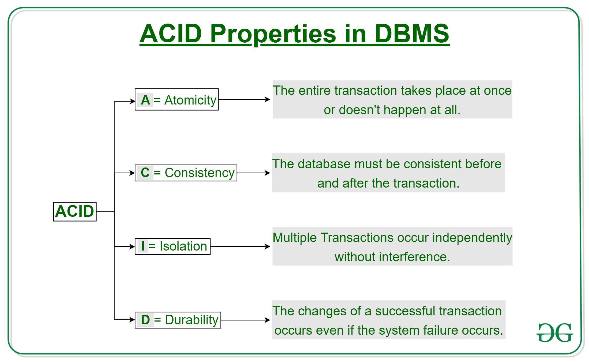

**What are indexes?** \
**Ans:** A [*database
index*](http://en.wikipedia.org/wiki/Database_index) is a data structure
that improves the speed of data retrieval operations on a database table
at the cost of additional writes and the use of more storage space to
maintain the extra copy of data.\
Data can be stored only in one order on disk. To support faster access
according to different values, faster search like binary search for
different values is desired, For this purpose, indexes are created on
tables. These indexes need extra space on disk, but they allow faster
search according to different frequently searched values.

**What are clustered and non-clustered Indexes?**\
**Ans:** Clustered indexes is the index according to which data is
physically stored on disk. Therefore, only one clustered index can be
created on a given database table.\
Non-clustered indexes don’t define physical ordering of data, but
logical ordering. Typically, a tree is created whose leaf point to disk
records. [*B-Tree*](http://en.wikipedia.org/wiki/B-tree) or [*B+
tree*](http://en.wikipedia.org/wiki/B+_tree) are used for this purpose

SQL Interview Questions
=======================

1.  **What is SQL?**\
    SQL stands for Structured Query Language. It is a language used to
    interact with the database, i.e to create a database, to create a
    table in the database, to retrieve data or update a table in the
    database etc. SQL is an ANSI(American National Standards
    Institute) standard. Using SQL, we can do many things, for example
    – we can execute queries, we can insert records in a table, we can
    update records, we can create a database, we can create a table,
    we can delete a table etc.

2.  **What is a Database?**\
    A Database is defined as a structured form of data which is stored
    in a computer or data in an organised manner and can be accessed
    in various ways. It is also the collection of schemas, tables,
    queries, views etc. Database helps us in easily storing, accessing
    and manipulation of data held in a computer. The Database
    Management System allows a user to interact with the database.

3.  **Does SQL support programming language features ?**\
    It is true that SQL is a language but it does not support
    programming as it is not a programming language, it is a command
     language. We do not have conditional statements in SQL like for
    loops or if..else, we only have commands which we can use to
    query, update , delete etc. data in the database. SQL allows us to
    manipulate data in a database.

4.  **What are the differences between SQL and PL/SQL?**\
    Ans: Some common differences between SQL and PL/SQL are as shown
    below:

  **<span style="font-variant:small-caps;">SQL</span>** |  **<span style="font-variant:small-caps;">PL/SQL</span>**
  --- | ---
  SQL is a query execution or commanding language |        PL/SQL is a complete programming language
  SQL is data oriented language |                          PL/SQL is a procedural language
  SQL is very declarative in nature |                      PL/SQL has a procedural nature
  It is used for manipulating data |                       It is used for creating applications
  We can execute one statement at a time in SQL |          We can execute block of statements in PL/SQL
  SQL tells database, what to do |                        PL/SQL tells database how to do
  We can embed SQL in PL/SQL |                             We can not embed PL/SQL in SQL

5.  **What is the difference between BETWEEN and IN operators in SQL?**\
    **BETWEEN**\
    The **BETWEEN** operator is used to fetch rows based on a range of
    values.\
    For example,
```sql
SELECT * FROM Students

WHERE ROLL_NO BETWEEN 20 AND 30;
```
This query will select all those rows from the table Students where
the value of the field ROLL\_NO lies between 20 and 30.\

**IN**\
The **IN** operator is used to check for values contained in specific
sets.\
For example,
```sql
SELECT * FROM Students

WHERE ROLL_NO IN (20,21,23);
```
This query will select all those rows from the table Students where
the value of the field ROLL\_NO is either 20 or 21 or 23.

6.  **Write an SQL query to find names of employee start with ‘A’?**\
    The LIKE operator of SQL is used for this purpose. It is used to
    fetch filtered data by searching for a particular pattern in where
    clause.\
    The Syntax for using LIKE is:
```sql
SELECT column1,column2 FROM table_name WHERE column_name LIKE pattern;
```
**LIKE**: operator name

**pattern**: exact value extracted from the pattern to get related data in result set.

The required query is:
```sql
SELECT * FROM Employees WHERE EmpName like 'A%' ;
```
You may refer to this article on [*WHERE
clause*](https://www.geeksforgeeks.org/sql-where-clause/) for more
details on LIKE operator.

7.  **What is the difference between CHAR and VARCHAR2 datatype in
    SQL?**\
    Both of these datatypes are used for characters but varchar2 is
    used for character strings of variable length whereas char is used
    for character strings of fixed length. For example, if we specify
    the type as char(5) then we will not be allowed to store string of
    any other length in this variable but if we specify the type of
    this variable as varchar2(5) then we will be allowed to store
    strings of variable length, we can store a string of length 3 or 4
    or 2 in this variable.

8.  **Name different types of case manipulation functions available in
    SQL.**\
    There are three types of case manipulation functions available in
    SQL. They are,

    -   **LOWER**: The purpose of this function is to return the string
        in lowercase. It takes a string as argument and returns the
        string by converting it into lower case.\
        Syntax:

    -   LOWER('string')

    -   **UPPER**:The purpose of this function is to return the string
        in uppercase. It takes a string as argument and returns the
        string by converting it into uppercase.\
        Syntax:

    -   UPPER('string')

    -   **INITCAP**:The purpose of this function is to return the string
        with first letter in uppercase and rest of the letters in
        lowercase.\
        Syntax:

    -   INITCAP('string')

3.  **What do you mean by data definition language?**\
    Data definition language or DDL allows to execute queries like
    CREATE, DROP and ALTER. That is, those queries which define the
    data.

4.  **What do you mean by data manipulation language?**\
    Data manipulation Language or DML is used to access or manipulate
    data in the database.\
    It allows us to perform below listed functions:

    -   Insert data or rows in database

    -   Delete data from database

    -   Retrieve or fetch data

    -   Update data in database

5.  **What is the difference between primary key and unique
    constraints?**\
    Primary key cannot have NULL value, the unique constraints can
    have NULL values. There is only one primary key in a table, but
    there can be multiple unique constrains. The primary key creates
    the cluster index automatically but the Unique key does not.

6.  **What is a view in SQL?**\
    Views in SQL are kind of virtual tables. A view also has rows and
    columns as they are in a real table in the database. We can create
    a view by selecting fields from one or more tables present in the
    database. A View can either have all the rows of a table or
    specific rows based on certain condition.\
    The CREATE VIEW statement of SQL is used for creating Views.\
    Basic Syntax:
```sql
CREATE VIEW view_name AS

SELECT column1, column2.....

FROM table_name

WHERE condition;

view_name: Name for the View

table_name: Name of the table

condition: Condition to select rows
```
For more details on how to create and use view, please refer
to [*this*](https://www.geeksforgeeks.org/sql-views/) article.

1.  **What do you mean by foreign key?**\
    A Foreign key is a field which can uniquely identify each row in
    another table. And this constraint is used to specify a field as
    Foreign key. That is, this field points to primary key of another
    table. This usually creates a kind of link between the two
    tables.\
    Consider the two tables as shown below:

**Orders**

  **<span style="font-variant:small-caps;">O\_ID</span>** | **<span style="font-variant:small-caps;">ORDER\_NO</span>** | **<span style="font-variant:small-caps;">C\_ID</span>**
  --- | --- | ---
  1 | 2253 | 3
  2 | 3325 | 3
  3 | 4521 | 2
  4 | 8532 | 1

**Customers**

  **<span style="font-variant:small-caps;">C\_ID</span>** | **<span style="font-variant:small-caps;">NAME</span>** | **<span style="font-variant:small-caps;">ADDRESS</span>**
  --- | --- | ---
  1 | RAMESH | DELHI
  2 |  SURESH | NOIDA
  3 |  DHARMESH | GURGAON

As we can see clearly that the field C\_ID in Orders table is the
primary key in Customers table, i.e. it uniquely identifies each row
in the Customers table. Therefore, it is a Foreign Key in Orders
table.\
Syntax:
```sql
CREATE TABLE Orders
(
O_ID int NOT NULL,
ORDER_NO int NOT NULL,
C_ID int,
PRIMARY KEY (O_ID),
FOREIGN KEY (C_ID) REFERENCES Customers(C_ID)
);
```
1.  **What is a join in SQL? What are the types of joins?**\
    An SQL Join statement is used to combine data or rows from two or
    more tables based on a common field between them. Different types
    of Joins are:

    -   **INNER JOIN**: The INNER JOIN keyword selects all rows from
        both the tables as long as the condition satisfies. This
        keyword will create the result-set by combining all rows from
        both the tables where the condition satisfies i.e value of the
        common field will be same.

    -   **LEFT JOIN**:This join returns all the rows of the table on the
        left side of the join and matching rows for the table on the
        right side of join. The rows for which there is no matching
        row on right side, the result-set will contain null. LEFT JOIN
        is also known as LEFT OUTER JOIN

    -   **RIGHT JOIN**:RIGHT JOIN is similar to LEFT JOIN. This join
        returns all the rows of the table on the right side of the
        join and matching rows for the table on the left side of join.
        The rows for which there is no matching row on left side, the
        result-set will contain null. RIGHT JOIN is also known as
        RIGHT OUTER JOIN.

    -   **FULL JOIN**: FULL JOIN creates the result-set by combining
        result of both LEFT JOIN and RIGHT JOIN. The result-set will
        contain all the rows from both the tables. The rows for which
        there is no matching, the result-set will contain NULL values.

To know about each of these joins in details,
refer [*this*](https://www.geeksforgeeks.org/sql-join-set-1-inner-left-right-and-full-joins/).

1.  **What is an index?**\
    A database index is a data structure that improves the speed of
    data retrieval operations on a database table at the cost of
    additional writes and the use of more storage space to maintain
    the extra copy of data. Data can be stored only in one order on
    disk. To support faster access according to different values,
    faster search like binary search for different values is desired.
    For this purpose, indexes are created on tables. These indexes
    need extra space on disk, but they allow faster search according
    to different frequently searched values.

**NOTES**

[***E-R
Diagram***](https://www.geeksforgeeks.org/database-management-system-er-model/):
The most common asked questions in ER diagram is minimum number of
tables required for a given ER diagram. Generally, following criteria
are used:

 

 

  Cardinality | Minimum No. of tables
  --- | ---
  1:1 cardinality with partial participation of both entities | 2
  1:1 cardinality with total participation of atleast 1 entity | 1
  1:n cardinality | 2
  m:n cardinality | 3

 

**Note:** This is a general observation. Special cases need to be taken
care. We may need extra table if attribute of a relationship can’t be
moved to any entity side.

 

 

[***Keys of a
relation***](https://www.geeksforgeeks.org/dbms-keys-candidate-super-primary-alternate-and-foreign/):
There are various types of keys in a relation which are:

-   **Candidate Key:** The minimal set of attributes which can determine
    a tuple uniquely. There can be more than 1 candidate key of a
    relation and its proper subset can’t determine tuple uniquely and
    it can’t be NULL.

-   **Super Key:** The set of attributes which can determine a tuple
    uniquely. A candidate key is always a super key but vice versa is
    not true.

-   **Primary Key and Alternate Key:** Among various candidate keys, one
    key is taken primary key and others are alternate keys.

-   **Foreign Key:** Foreign Key is a set of attributes in a table which
    is used to refer the primary key or alternative key of the same or
    other table.

 

[***Normal
Forms***](https://www.geeksforgeeks.org/database-normalization-normal-forms/)

-   **First Normal Form:** A relation is in first normal form if it does
    not contain any multi-valued or composite attribute.

-   **Second Normal Form:** A relation is in second normal form if it
    does not contain any partial dependency. A dependency is called
    partial dependency if any proper subset of candidate key
    determines non-prime (which are not part of candidate key)
    attribute.

-   **Third Normal Form:** A relation is in third normal form if it does
    not contain any transitive dependency. For a relation to be in
    Third Normal Form, either LHS of FD should be super key or RHS
    should be prime attribute.

-   **Boyce-Codd Normal Form:** A relation is
    in **Boyce-Codd** Normal Form if LHS of every FD is super key.
    The relationship between Normal Forms can be represented
    as: **1NF⊃2NF ⊃3NF ⊃BCNF**

 

 

[***Relational
Algebra***](https://www.geeksforgeeks.org/database-management-system-relational-algebra/):
Procedural language with basic and extended operators.

 

  [***Basic Operator***](https://www.geeksforgeeks.org/basic-operators-in-relational-algebra-2/) | **Semantic**
  --- | ---
  **σ(Selection)**       |                                                                          Select rows based on given condition
  **∏(Projection)** |                                                                               Project some columns
  **X (Cross Product)** |                                                                           Cross product of relations, returns **m*n**rows where m and n are number of rows in R1 and R2 respectively.
  **U (Union)** |                                                                                   Return those tuples which are either in R1 or in R2. Max no. of rows returned **= m+n** andMin no. of rows returned =**max(m,n)**
  **−(Minus)** |                                                                                    R1-R2 returns those tuples which are in R1 but not in R2. Max no. of rows returned = **m** and Min no. of rows returned = **m-n**
  **ρ(Rename)** |                                                                                    Renaming a relation to other relation.

  

  [***Extended Operator***](https://www.geeksforgeeks.org/extended-operators-in-relational-algebra/) |   **Semantic**
  --- | ---
  **∩ (Intersection)** |                                                                                Returns those tuples which are in both R1 and R2. Max no. of rows returned = min(m,n) and Min no. of rows returned = 0
  **⋈~c~(Conditional Join)** |                                                                          Selection from two or more tables based on some condition (Cross product followed by selection)
  **⋈(Equi Join)** |                                                                                    It is a special case of conditional join when only equality condition is applied between attributes.
  **⋈(Natural Join)** |                                                                                 In natural join, equality condition on common attributes hold and duplicate attributes are removed by default.**Note:** Natural Join is equivalent to cross product if two relations have no attribute in common and natural join of a relation R with itself will return R only.
  **⟕(Left Outer Join)** |                                                                              When applying join on two relations R and S, some tuples of R or S does not appear in result set which does not satisfy the join conditions. But Left Outer Joins gives all tuples of R in the result set. The tuples of R which do not satisfy join condition will have values as NULL for attributes of S.
  **⟖(Right Outer Join)** |                                                                             When applying join on two relations R and S, some tuples of R or S does not appear in result set which does not satisfy the join conditions. But Right Outer Joins gives all tuples of S in the result set. The tuples of S which do not satisfy join condition will have values as NULL for attributes of R.
  **⟗(Full Outer Join)** |                                                                              When applying join on two relations R and S, some tuples of R or S does not appear in result set which does not satisfy the join conditions. But Full Outer Joins gives all tuples of S and all tuples of R in the result set. The tuples of S which do not satisfy join condition will have values as NULL for attributes of R and vice versa.
  **/(Division Operator)** |                                                                            Division operator A/B will return those tuples in A which is associated with every tuple of B.**Note:**Attributes of B should be proper subset of attributes of A. The attributes in A/B will be Attributes of A- Attribute of B.

 

 
\
[***SQL***](https://www.geeksforgeeks.org/sql-tutorial/): As opposed to
Relational Algebra, SQL is a non-procedural language.

 

  **Operator** |                                                                                                **Meaning**
  --- | ---
  [***Select***](https://www.geeksforgeeks.org/sql-select-query/) |                                             Selects columns from a relation or set of relations. **Note: **As opposed to Relational Algebra, it may give duplicate tuples for repeated value of an attribute.
  [***From***](https://www.geeksforgeeks.org/sql-sub-queries-clause/) |                                          **From** is used to give input as relation or set of relations from which data needs to be selected.
  [***where***](https://www.geeksforgeeks.org/sql-where-clause/) |                                              **Where** is used to give condition to be used to filter tuples
  [***EXISTS***](https://www.geeksforgeeks.org/sql-exists/) |                                                  **EXISTS** is used to check whether the result of a correlated nested query is empty (contains no tuples) or not.
  [***Group By***](https://www.geeksforgeeks.org/sql-group-by/) |                                               **Group By** is used to group the tuples based on some attribute or set of attributes like counting the no. of students group by department.
  [***Order By***](https://www.geeksforgeeks.org/sql-order-by/) |                                               **Order By** is used to sort the fetched data in either ascending or descending according to one or more columns.
  [***Aggregate functions***](https://www.geeksforgeeks.org/database-management-system-aggregate-functions/) |  Find the aggregated value of an attribute. Used mostly with group by. e.g.; count, sum, min max. **select count(*) from student group by dept\_idNote:** we can select only those columns which are part of group by.
  [***Nested Queries***](https://www.geeksforgeeks.org/nested-queries-sql/) |                                   When one query is a part of other query. Solving nested queries questions can be learnt in **http://quiz.geeksforgeeks.org/nested-queries-sql/**

 

[***Conflict serializable and Conflict
Equivalent***](https://www.geeksforgeeks.org/conflict-serializability/):
A schedule is conflict serializable if it is conflict equivalent to a
serial schedule.

**Checking for Conflict Serializability**

To check whether a schedule is conflict serializable or not, find
all **conflicting operations pair**s of a schedule and draw precedence
graph ( For all conflicting operation pair, an edge from Ti to Tj if one
operation of conflicting pair is from Ti and other from Tj and operation
of Ti occurs before Tj in schedule). If graph does not contain cycle,
the schedule is conflict serializable else it is not conflict
serializable.

Schedules are said to be conflict equivalent if 1 schedule can be
converted into another by swapping non conflicting operations.

**Note:** Two phase locking protocol produce conflict serializable
schedule but may suffer from deadlock. On the other hand, Time-Stamp
based protocols are free from deadlock yet produce conflict serializable
schedule.

[***View Serializable and View
Equivalence***](https://www.geeksforgeeks.org/dbms-how-to-test-two-schedule-are-view-equal-or-not-2/) :
Two schedules S1 and S2 are said to be view-equivalent if all conditions
are satisfied for all objects:

-   If the transaction Ti in S1 reads an initial value for object X, in
    S2 also, Ti must read the initial value of X.

-   If the transaction Ti in S1 reads the value written by
    transaction Tj in S1 for object X, same should be done in S2.

-   If the transaction Ti in S1 is the final transaction to write the
    value for an object X, in S2 also, Ti must write the final value
    of X.

A schedule is view serializable if it is view equivalent to any serial
schedule.

 

**Irrecoverable Schedules:** For a transaction pair < Ti, Tj >,
if Tj is reading the value updated by Ti and Tj is committed before
commit of Ti, the schedule will be irrecoverable.

 

**Recoverable Schedules:** For a transaction pair < Ti, Tj >,
ifTj is reading the value updated by Ti and Tj is committed after commit
of Ti, the schedule will be recoverable.

 

**Cascadeless Recoverable Schedules:** For a transaction pair
< Ti, Tj >, if value updated by Ti is read by Tj only after commit
of Ti, the schedule will be cascadeless recoverable.

 

**Strict Recoverable:** For a transaction pair < Ti, Tj >, if
value updated by Ti is read or written by Tj only after commit of Ti,
the schedule will be strict recoverable. The relationship between them
can be represented as:

 

**Strict ⊂ Cascadeless Recoverable ⊂ recoverable ⊂ all schedules**

 

***File structures***

**Primary Index :**: A primary index is an ordered file, records of
fixed length with two fields. First field is same as primary key as data
file and second field is a pointer to data block, where the key is
available.

The average number of block accesses using index = **log~2~ Bi + 1**,
where Bi = number of index blocks.\
 \
**Clustering Index : **Clustering index is created on data file whose
records are physically ordered on a non-key field (called Clustering
field).\
 \
**Secondary Index : **Secondary index provides secondary means of
accessing a file for which primary access already exists.

Number of index entries = Number of records

 

[***B
Trees***](https://www.geeksforgeeks.org/b-tree-set-1-introduction-2/)\
At every level , we have Key and Data Pointer and data pointer points to
either block or record.

[***Properties of B-Trees
:***](https://www.geeksforgeeks.org/b-tree-set-1-introduction-2/)\
Root of B-tree can have children between **2** and **P**, where P is
Order of tree.

**Order of tree** – Maximum number of children a node can have.

Internal node can have children between **⌈ P/2 ⌉** and **P **\
Internal node can have keys between **⌈ P/2 ⌉ – 1** and**P-1**

[***B+
Trees***](https://www.geeksforgeeks.org/database-file-indexing-b-tree-introduction/)\
In B+ trees structure of leaf and non-leaf are different, so their order
is. Order of non-leaf will be higher as compared to leaf nodes.

Searching time will be less in B+ tress, since it doesn’t have record
pointers in non-leaf because of which depth will decrease.

## Computer Networking

## Commonly asked Computer Networks Interview Questions | Set 1


**What are Unicasting, Anycasting, Multicasting and Broadcasting?**\
If the message is sent from a source to a single destination node, it is
called Unicasting. This is typically done in networks.

If the message is sent from a source to any of the given destination
nodes. This is used a lot in Content delivery Systems where we want to
get content from any server.

If the message is sent to some subset of other nodes, it is called
Multicasting. Used in the situation when there are multiple receivers of
the same data. Like video conferencing, updating something on CDN
servers which have a replica of same data.\
If the message is sent to all the nodes in a network it is called
Broadcasting. This is typically used in Local networks, for example,
DHCP and ARP use broadcasting.

**What are layers in OSI model?**

1.  Physical Layer Converts data bit into an electrical impulse.

2.  Data Link Layer Data packet will be encoded and decoded into bits.

3.  Network Layer Transfer of datagrams from one to another.

4.  Transport Layer Responsible for Data transfer from one to another.

5.  Session Layer Manage and control signals between computers.

6.  Presentation Layer Transform data into application layer format.

7.  Application Layer An end user will interact with the Application
    layer.

The model is a theoretical stack of seven layers that can be used as a
reference to

help understand how networks operate. The model was introduced to
standardize networks in a way that allowed multi vendor systems. Prior
to this, you would only be able to have a one vendor network because the
devices from one vendor couldn't communicate with others. It is worth
nothing that we dont actually use the OSI model, we use something called
the TCP/IP model. The concepts are exactly the same. the layers are
slightly

different.

Layers

**Layer1: Physical layer**

carries data across physical hardware.

User: ethernet cables.

Examples:

-are all the cables plugged in?

-Is the network card functioning?

-Could it be a faulty cable?

**Layer 2: Data Link layer**

At this layer, the physical addresses are added to the data. This is
source and

destination mac addresses.

Switches operate at this layer

Example:

-Maybe the switch has gone bad?

**Layer 3: Network layer**

The network layer handles ip addressing and routing. At this layer, the
source

and destination IP addresses are added.

Routers operate at this layer

Example:

-Is the router functioning?

-Do i have the right IP address?

**Layer 4: Transport layer**

This layer adds transport protocols such as TCP/UDP, and adds
source/destination

port numbers.

Example:

-Could the internet card be functional?

**Layer 5: Session layer**

this layer is responsible for establishing and terminating connections
between devices.

Example:

-Are you connecting to the correct address?

**Layer 6: Presentation layer**

This layer formats the data in a way the receiving application can
understand it. This

layer can also encrypt and decrypt data if needed

Example:

-Are you reading the data in the same order that you wrote it?

**Layer 7: Application layer**

This layer is where the application and user communicates

Applications used here such as SMTP, if you're sending an email for
example.

Example:

-Is the application erroring out?

**What is Stop-and-Wait Protocol?**\
In Stop and wait protocol, a sender after sending a frame waits for an
acknowledgment of the frame and sends the next frame only when
acknowledgment of the frame has received.

**What is Piggybacking?**\
Piggybacking is used in bi-directional data transmission in the network
layer (OSI model). The idea is to improve efficiency piggyback
acknowledgment (of the received data) on the data frame (to be sent)
instead of sending a separate frame.

**Differences between Hub, Switch and Router?**

  Hub | Switch | Router
  --- | --- | ---
  Physical Layer Device | Data Link Layer Device | Network Layer Device
  Simply repeats signal to all ports | Doesn’t simply repeat, but filters content by MAC or LAN address | Routes data based on IP address
  Connects devices within a single LAN | Can connect multiple sub-LANs within a single LAN | Connect multiple LANS and WANS together.
  [*Collision domain*](https://en.wikipedia.org/wiki/Collision_domain) of all hosts connected through Hub remains one. i.e., if signal sent by any two devices can collide.   Switch divides collision domain, but [*broadcast domain*](https://en.wikipedia.org/wiki/Broadcast_domain)of connected devices remains same.   It divides both collision and broadcast domains,
                                                                                                                                                                                                                                                                                                                            

See [*network
devices*](http://quiz.geeksforgeeks.org/network-devices-hub-repeater-bridge-switch-router-gateways/) for
more details.

**What happens when you type a URL in the web browser?**\
A URL may contain a request to HTML, image file or any other type.

1.  If the content of the typed URL is in the cache and fresh, then
    display the content.

2.  Else find the IP address for the domain so that a TCP connection can
    be set up. Browser does a DNS lookup.

3.  Browser needs to know the IP address for a URL so that it can set up
    a TCP connection.  This is why browser needs DNS service. The
    browser first looks for URL-IP mapping browser cache, then in OS
    cache. If all caches are empty, then it makes a recursive query to
    the local DNS server.   The local DNS server provides the IP
    address.

4.  Browser sets up a TCP connection using three-way handshake.

5.  Browser sends a HTTP request.

6.  Server has a web server like Apache, IIS running that handles
    incoming HTTP request and sends an HTTP response.

7.  Browser receives the HTTP response and renders the content.

**What is DHCP, how does it work?**

1.  The idea of DHCP (Dynamic Host Configuration Protocol) is to enable
    devices to get IP address without any manual configuration.

2.  The device sends a broadcast message saying “I am new here”

3.  The DHCP server sees the message and responds back to the device and
    typically allocates an IP address. All other devices on network
    ignore the message of the new device as they are not DHCP server.

In Wi-Fi networks, Access Points generally work as a DHCP server.

**What is ARP, how does it work?**\
ARP stands for Address Resolution Protocol. ARP is used to find LAN
address from the Network address. A node typically has destination IP to
send a packet, the nodes need link layer address to send a frame over a
local link. The ARP protocol helps here.

1.  The node sends a broadcast message to all nodes saying what is the
    MAC address of this IP address.

2.  Node with the provided IP address replies with the MAC address.

Like DHCP, ARP is a discovery protocol, but unlike DHCP there is not
server here.

**How does DNS work?**

**Domain :**

There are various kinds of DOMAIN :

1.  Generic domain : .com(commercial) .edu(educational) .mil(military)
    .org(non profit organization) .net(similar to commercial) all
    these are generic domain.

2.  Country domain .in (india) .us .uk

3.  Inverse domain if we want to know what is the domain name of the
    website. Ip to domain name mapping.So DNS can provide both the
    mapping for example to find the ip addresses of geeksforgeeks.org
    then we have to type nslookup www.geeksforgeeks.org.

**Hierarchy of Name Servers**

**Root name servers** – It is contacted by name servers that can not
resolve the name. It contacts authoritative name server if name mapping
is not known. It then gets the mapping and return the IP address to the
host.

**Top level server** – It is responsible for com, org, edu etc and all
top level country domains like uk, fr, ca, in etc. They have info about
authoritative domain servers and know names and IP addresses of each
authoritative name server for the second level domains.

**Authoritative name servers** This is organization’s DNS server,
providing authoritative hostName to IP mapping for organization servers.
It can be maintained by organization or service provider. In order to
reach cse.dtu.in we have to ask the root DNS server, then it will point
out to the top level domain server and then to authoritative domain name
server which actually contains the IP address. So the authoritative
domain server will return the associative ip address.

**Domain Name Server**

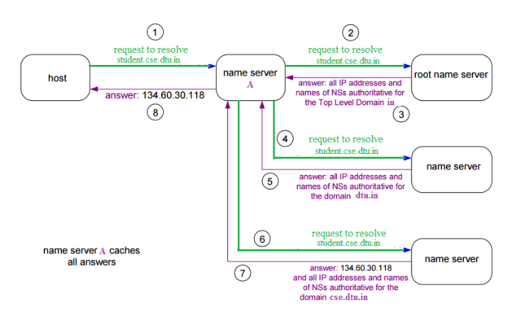

The client machine sends a request to the local name server, which , if
root does not find the address in its database, sends a request to the
root name server, which in turn, will route the query to an intermediate
or authoritative name server. The root name server can also contain some
hostName to IP address mappings . The intermediate nae server always
knows who the authoritative name server is. So finally the IP address is
returned to the local name server which in turn returns the IP address
to the host.

**Recursive Resolution** –\
Here, client requires the Local Server to give either the requested
mapping or an error message. A DNS Query is generated by the application
program to the resolver to fetch the destination IP Address. The Query
is then forward to the local DNS Server. If it knows the IP Address, it
sends a response to the resolver. Assuming, it does not know the IP
Address, it sends the query to the root name server.\
The root name server contains information of about at least one server
of Top Level Domain. The query is then sent to the respective Top-Level
Domain server. If it contains the mapping, the response is sent back to
the root server and then to host’s local server. If it doesn’t contain
the mapping, it should contain the IP Address of destination’s local DNS
Server. The local DNS server knows the destination host’s IP Address.
The information is then sent back to the top-level domain server, then
to the root server and then to the host’s Local DNS Server and finally
to the host.\
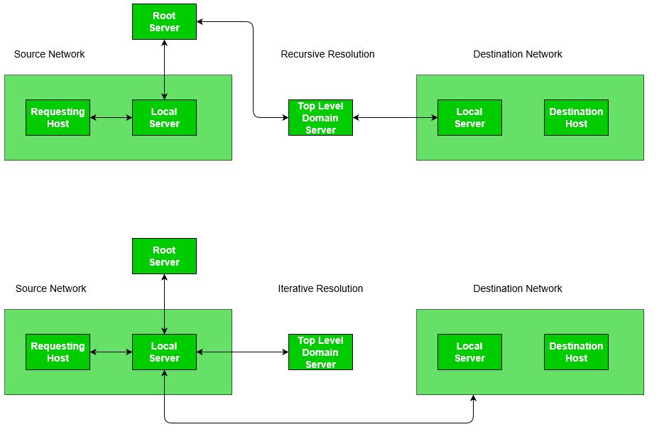

**NOTES**

**OSI Layers, Data units and Functions:**

  **LAYERS**    |      **DATA UNITS**  |   **FUNCTIONS**
  --- | --- | ---
  Application Layer |  Data            |   Mail Services, Directory Services, FTAM
  Presentation Layer | Data |              Translation, Compression, Encryption/Decryption
  Session Layer |      Data |              Session Establishment, Synchronization,Dialog Controller
  Transport Layer |    Segments,Datagram | Segmentation, Flow Control, Error Control, TCP/UDP
  Network Layer |      Packets |           Logical Addressing, Routing, Traffic control, Fragmentation
  Data Link Layer |    Frames |            Physical Addressing, Flow control,Error control,Access control
  Physical Layer |     Bits |              Bit Synchronization,Bit rate control,Physical Topologies

**Layers and their uses –**\
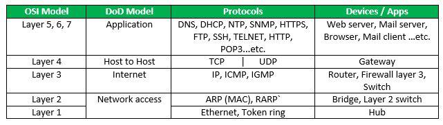

**Physical Layer**

[***Network
Topologies:***](https://www.geeksforgeeks.org/network-topologies-computer-networks/)

-   **Mesh Topology:**\
    In mesh topology, every device is connected to another device via
    particular channel.If suppose, N number of devices are connected
    with each other, then total number of links required to connect
    NC~2~.

-   **Bus Topology:**\
    Bus topology is a network type in which every computer and network
    device is connected to single cable. If N devices are connected,
    then the number of cables required 1 which is known as backbone
    cable and N drop lines are required.

-   **Star Topology:**\
    In star topology, all the devices are connected to a single hub
    through a cable. If N devices are connected to each other, then
    the no. of cables required N.

-   **Ring Topology:**\
    In this topology, it forms a ring connecting a devices with its
    exactly two neighboring devices.

[***Transmission
Modes:***](https://www.geeksforgeeks.org/transmission-modes-computer-networks/)

-   **Simplex Mode**: the communication is unidirectional, as on a
    one-way street.Only one of the two devices on a link can transmit,
    the other can only receive.

-   **Half-duplex Mode**: each station can both transmit and receive,
    but not at the same time.

-   **Full-duplex Mode**: both stations can transmit and receive
    simultaneously.

[***Manchester
Encoding***](https://www.geeksforgeeks.org/computer-network-manchester-encoding/):
When there is a long sequence of 0s and 1s, there is a problem at the
receiving end. The problem is that the synchronization is lost due to
lack of transmissions.

-   **NRZ-level encoding **: The polarity of signals changes when
    incoming siganl changes from ‘1’ to ‘0’ or from ‘0’ to ‘1’. It
    considers the first bit data as polarity change.

-   **NRZ-Inverted/ Differential encoding**:In this, the transitions at
    the beginning of bit interval is equal to 1 and if there is no
    transition at the beginning of bit interval is equal to 0.

**Data Link Layer**

1.  **Flow Control**\
    N = Sender’s Window Size. (in SR both sender and receiver window
    are same)\
    a = T~p~ /T~t~

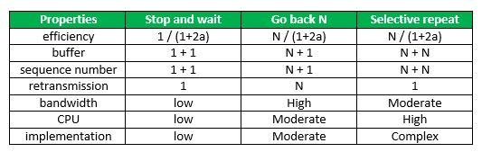

1.  Sequence No. >= (Sender’s Window Size) + (Reciever’s Window Size
    )

2.  Efficiency in TDM(polling) = T~t~ / (T~poll~ + T~t~)

3.  In CSMA/CD, T~t~ >= 2*T~p~\
    Hence, min frame length = 2*T~p~*B

4.  In CSMA/CD, Efficiency = 1/(1 + 6.44a)

5.  [***Back-off Algorithm for
    CSMA/CD***](https://www.geeksforgeeks.org/back-off-algorithm-csmacd/)\
    Waiting time = back–off time\
    Let n = collision number or re-transmission serial number.\
    Then, Waiting time = K * T~slot~\
    where K = \[0, 2<sup>n</sup> – 1 \]

6.  N = No. of stations\
    Early Token Reinsertion : Efficiency = 1/(1 + a/N)\
    Delayed Token Reinsertion : Efficiency = 1/(1 + (N+1)a/N)

7.  Pure Aloha Efficiency = 18.4 %\
    Slotted Aloha Efficiency = 36.8%

8.  [***Maximum data rate (channel capacity) for noiseless and noisy
    channels***](https://www.geeksforgeeks.org/computer-network-maximum-data-rate-channel-capacity-noiseless-noisy-channels/)

    -   **Noiseless Channel : Nyquist Bit Rate**\
        BitRate = 2 * Bandwidth * log2(L)\
        where,L is the number of signal levels used to represent data.

    -   **Noisy Channel : Shannon Capacity**\
        Capacity = bandwidth * log2(1 + SNR)\
        where, SNR is the signal-to-noise ratio

 

9.  **Error Control**

    -   [***Hamming
        Code***](https://www.geeksforgeeks.org/computer-network-hamming-code/):
        is a set of error-correction codes that can be used to detect
        and correct the errors that can occur when the data is moved
        or stored from the sender to the receiver.\
        **Redundant bits:**\
        2^r^ ≥ m + r + 1\
        where, r = redundant bit, m = data bit

    -   [***Framing in
        DLL***](https://www.geeksforgeeks.org/computer-network-framing-data-link-layer/):
        It provides a way for a sender to transmit a set of bits that
        are meaningful to the receiver.\
        **Character/Byte Stuffing:** Used when frames consist of
        character. If data contains ED then, byte is stuffed into data
        to diffentiate it from ED.\
        **Bit stuffing**: Sender stuffs a bit to break the pattern
        i.e. here appends a 0 in data = 0111**0**1.

**Network Layer**

[***Class Full Addressing
Table***](https://www.geeksforgeeks.org/ip-addressing-introduction-and-classful-addressing/):\
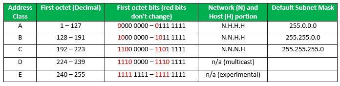

[***IPv4 header
datagram***](https://www.geeksforgeeks.org/network-layer-introduction-ipv4/):\
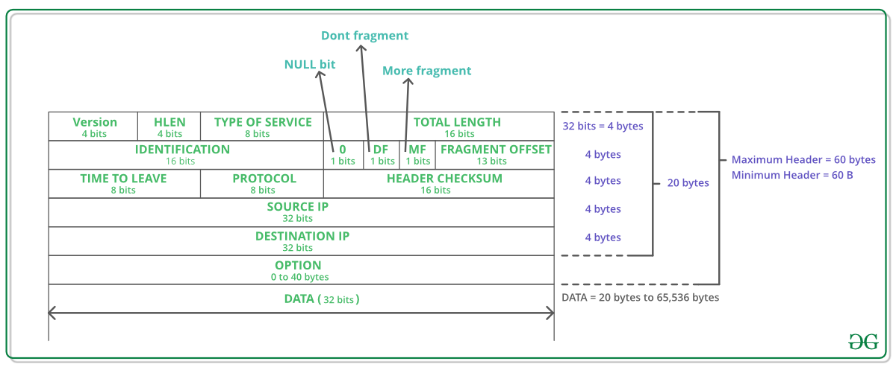

[***IP version 6 Header
Format***](https://www.geeksforgeeks.org/computer-network-internet-protocol-version-6-ipv6-header/)\
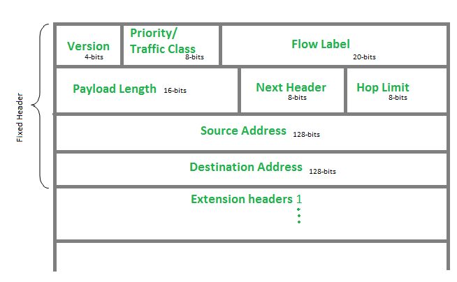

[***Internet Control Message
Protocol***](https://www.geeksforgeeks.org/internet-control-message-protocol-icmp/):
Since IP does not have a inbuilt mechanism for sending error and control
messages. It depends on Internet Control Message Protocol(ICMP) to
provide an error control.

1.  Source quench message

2.  Parameter problem

3.  Time exceeded message

4.  Destination un-reachable

 \
[***Difference between DVR and
LSR***](https://www.geeksforgeeks.org/computer-network-distance-vector-routing-vs-link-state-routing/)\
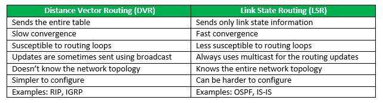

[***Open shortest path first
(OSPF)***](https://www.geeksforgeeks.org/open-shortest-path-first-ospf-router-roles-configuration/):
Open shortest path first (OSPF) is a link-state routing protocol which
is used to find the best path between the source and the destination
router using its own SPF algorithm.\
Designated Router(DR) and Backup Designated Router(BDR) election takes
place in broadcast network or multi-access network.\
**Criteria for the election:**

1.  Router having the highest router priority will be declared as DR.

2.  If there is a tie in router priority then highest router will be
    considered. First, highest loopback address is considered. If no
    loopback is configured then the highest active IP address on the
    interface of the router is considered.

[***Routing Information
Protocol(RIP)***](https://www.geeksforgeeks.org/computer-network-routing-information-protocol-rip/):
is a dynamic routing protocol which uses hop count as a routing metric
to find the best path between the source and the destination network. It
is a distance vector routing protocol which has AD value 120 and works
on the application layer of OSI model. RIP uses port number 520.

**Hop Count**:

1.  Hop count is the number of routers occurring in between the source
    and destination network. The path with the lowest hop count is
    considered as the best route to reach a network and therefore
    placed in the routing table.

2.  The maximum hop count allowed for RIP is 15 and hop count of 16 is
    considered as network unreachable.

**Transport Layer**

[***TCP
header***](https://www.geeksforgeeks.org/tcp-services-and-segment-structure/)\
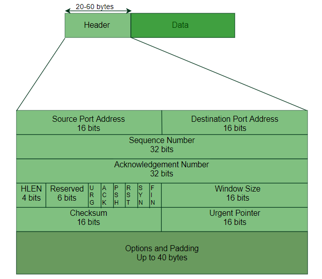

[***In TCP congestion control
Algorithm***](https://www.geeksforgeeks.org/computer-network-tcp-congestion-control/)\
When Time Out Occurs Algorithm Enters Slow Start Phase\
When 3 Duplicate occurs algorithm enters congestion avoidance phase

[***TCP 3-Way Handshake
Process***](https://www.geeksforgeeks.org/computer-network-tcp-3-way-handshake-process/)\
**Step 1 (SYN)** : In the first step, client wants to establish a
connection with server, so it sends a segment with SYN(Synchronize
Sequence Number) which informs server that client is likely to start
communication and with what sequence number it starts segments with\
**Step 2 (SYN + ACK)**: Server responds to the client request with
SYN-ACK signal bits set. Acknowledgement(ACK) signifies the response of
segment it received and SYN signifies with what sequence number it is
likely to start the segments with\
**Step 3 (ACK)** : In the final part client acknowledges the response of
server and they both establish a reliable connection with which they
will start eh actual data transfer.\
 

[***UDP header***](https://www.geeksforgeeks.org/gate-cs-notes-gq/)\
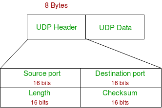

Refer the [*Differences between TCP and
UDP*](https://www.geeksforgeeks.org/differences-between-tcp-and-udp/)

**Application Layer**

[***Domain Name
Server***](https://www.geeksforgeeks.org/dns-domain-name-server/): DNS
is a host name to IP address translation service. DNS is a distributed
database implemented in a hierarchy of name servers. It is an
application layer protocol for message exchange between clients and
servers.

[***Dynamic Host Configuration
Protocol(DHCP)***](https://www.geeksforgeeks.org/computer-network-dynamic-host-configuration-protocol-dhcp/) is
an application layer protocol which is used to provide:\
Subnet Mask (Option 1 – e.g., 255.255.255.0)\
Router Address (Option 3 – e.g., 192.168.1.1)\
DNS Address (Option 6 – e.g., 8.8.8.8)\
Vendor Class Identifier (Option 43 – e.g., ‘unifi’ = 192.168.1.9
##where unifi = controller)

[***Simple Network Management Protocol
(SNMP)***](https://www.geeksforgeeks.org/computer-network-simple-network-management-protocol-snmp/):
SNMP is an application layer protocol which uses UDP port number
161/162.SNMP is used to monitor network, detect network faults and
sometimes even used to configure remote devices.

[***Simple Mail Transfer Protocol
(SMTP)***](https://www.geeksforgeeks.org/simple-mail-transfer-protocol-smtp/):
SMTP is an application layer protocol. The client who wants to send the
mail opens a TCP connection to the SMTP server and then sends the mail
across the connection. The SMTP server is always on listening mode. As
soon as it listens for a TCP connection from any client, the SMTP
process initiates a connection on that port (25). After successfully
establishing the TCP connection the client process sends the mail
instantly.

[***File Transfer Protocol
(FTP)***](https://www.geeksforgeeks.org/computer-network-file-transfer-protocol-ftp/):
File Transfer Protocol(FTP) is an application layer protocol which moves
files between local and remote file systems. It runs on the top of TCP,
like HTTP. To transfer a file, 2 TCP connections are used by FTP in
parallel: control connection and data connection.

[***Hypertext Transfer Protocol
(HTTP)***](https://www.geeksforgeeks.org/http-non-persistent-persistent-connection/):
is an application-level protocol that uses TCP as an underlying
transport and typically runs on port 80. HTTP is a stateless protocol
i.e. server maintains no information about past client requests.

**Network Security**

For Symmetric Key : n*(n-1)/2 keys are required.\
For Public Key : 2*n key are required ( each node will have private and
public key).

[***RSA Algorithm in
Cryptography***](https://www.geeksforgeeks.org/rsa-algorithm-using-multiple-precision-arithmetic-library/)\
\
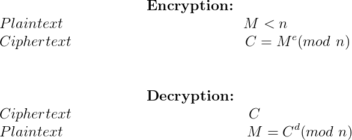

[***Deffie Hellman Key
Exchange***](https://www.geeksforgeeks.org/implementation-diffie-hellman-algorithm/)\
R1 = g<sup>x</sup> mod p\
R2 = g<sup>y</sup> mod q\
Both will have same key = g<sup>xy</sup> mod p

## Operating Systems

## Commonly Asked Operating Systems Interview Questions | Set 1

**What is a process and process table? What are different states of
process**\
A *process *is an instance of program in execution. For example a Web
Browser is a process, a shell (or command prompt) is a process.\
The operating system is responsible for managing all the processes that
are running on a computer and allocated each process a certain amount of
time to use the processor. In addition, the operating system also
allocates various other resources that processes will need such as
computer memory or disks. To keep track of the state of all the
processes, the operating system maintains a table known as the *process
table*. Inside this table, every process is listed along with the
resources the processes is using and the current state of the process.\
*Processes can be in one of three states: running, ready, or waiting*.
The running state means that the process has all the resources it need
for execution and it has been given permission by the operating system
to use the processor. Only one process can be in the running state at
any given time. The remaining processes are either in a waiting state
(i.e., waiting for some external event to occur such as user input or a
disk access) or a ready state (i.e., waiting for permission to use the
processor). In a real operating system, the waiting and ready states are
implemented as queues which hold the processes in these states. The
animation below shows a simple representation of the life cycle of a
process
(Source: [*http://courses.cs.vt.edu/csonline/OS/Lessons/Processes/index.html*](http://courses.cs.vt.edu/csonline/OS/Lessons/Processes/index.html))

**What is a Thread? What are the differences between process and
thread?**\
A thread is a single sequence stream within in a process. Because
threads have some of the properties of processes, they are sometimes
called *lightweight processes*. Threads are popular way to improve
application through parallelism. For example, in a browser, multiple
tabs can be different threads. MS word uses multiple threads, one thread
to format the text, other thread to process inputs, etc.\
A thread has its own program counter (PC), a register set, and a stack
space. Threads are not independent of one other like processes as a
result threads shares with other threads their code section, data
section and OS resources like open files and signals.
See [*http://www.personal.kent.edu/\~rmuhamma/OpSystems/Myos/threads.html*](http://www.personal.kent.edu/~rmuhamma/OpSystems/Myos/threads.htm) for
more details.

**Process vs Thread?**

The primary difference is that threads within the same process run in a
shared memory space, while processes run in separate memory spaces.

Threads are not independent of one another like processes are, and as a
result threads share with other threads their code section, data
section, and OS resources (like open files and signals). But, like
process, a thread has its own program counter (PC), register set, and
stack space.

**Advantages of Thread over Process**

1\. Responsiveness: If the process is divided into multiple threads, if
one thread completes its execution, then its output can be immediately
returned.

2\. Faster context switch: Context switch time between threads is lower
compared to process context switch. Process context switching requires
more overhead from the CPU.

3\. Effective utilization of multiprocessor system: If we have multiple
threads in a single process, then we can schedule multiple threads on
multiple processor. This will make process execution faster.

4\. Resource sharing: Resources like code, data, and files can be shared
among all threads within a process.

Note: stack and registers can’t be shared among the threads. Each thread
has its own stack and registers.

5\. Communication: Communication between multiple threads is easier, as
the threads shares common address space. while in process we have to
follow some specific communication technique for communication between
two process.

6\. Enhanced throughput of the system: If a process is divided into
multiple threads, and each thread function is considered as one job,
then the number of jobs completed per unit of time is increased, thus
increasing the throughput of the system.

**Types of Threads**

There are two types of threads.

User Level Thread

Kernel Level Thread

**What is deadlock?**\
Deadlock is a situation when two or more processes wait for each other
to finish and none of them ever finish.  Consider an example when two
trains are coming toward each other on same track and there is only one
track, none of the trains can move once they are in front of each other.
 Similar situation occurs in operating systems when there are two or
more processes hold some resources and wait for resources held by
other(s).

**What are the necessary conditions for deadlock?**\
*Mutual Exclusion:* There is a resource that cannot be shared.\
*Hold and Wait: *A process is holding at least one resource and waiting
for another resource which is with some other process.\
*No Preemption:* The operating system is not allowed to take a resource
back from a process until process gives it back.\
*Circular Wait:  *A set of processes are waiting for each other in
circular form.

**What is Virtual Memory? How is it implemented?**\
Virtual memory creates an illusion that each user has one or more
contiguous address spaces, each beginning at address zero. The sizes of
such virtual address spaces is generally very high.\
The idea of virtual memory is to use disk space to extend the RAM.
Running processes don’t need to care whether the memory is from RAM or
disk. The illusion of such a large amount of memory is created by
subdividing the virtual memory into smaller pieces, which can be loaded
into physical memory whenever they are needed by a process.

**What is Thrashing?**\
Thrashing is a situation when the performance of a computer degrades or
collapses. Thrashing occurs when a system spends more time processing
page faults than executing transactions. While processing page faults is
necessary to in order to appreciate the benefits of virtual memory,
thrashing has a negative affect on the system. As the page fault rate
increases, more transactions need processing from the paging device. The
queue at the paging device increases, resulting in increased service
time for a page fault 
(Source:[*http://cs.gmu.edu/cne/modules/vm/blue/thrash.html*](http://cs.gmu.edu/cne/modules/vm/blue/thrash.html))

**What is Belady’s Anomaly?**\
Bélády’s anomaly is an anomaly with some page replacement policies where
increasing the number of page frames results in an increase in the
number of page faults. It occurs with First in First Out page
replacement is used. See [*the wiki
page*](http://en.wikipedia.org/wiki/B%C3%A9l%C3%A1dy's_anomaly) for an
example and more details.

**Differences between mutex and semaphore?**

**Using Mutex:**

A mutex provides mutual exclusion, either producer or consumer can have
the key (mutex) and proceed with their work. As long as the buffer is
filled by producer, the consumer needs to wait, and vice versa.

At any point of time, only one thread can work with
the *entire* buffer. The concept can be generalized using semaphore.

**Using Semaphore:**

A semaphore is a generalized mutex. In lieu of single buffer, we can
split the 4 KB buffer into four 1 KB buffers (identical resources). A
semaphore can be associated with these four buffers. The consumer and
producer can work on different buffers at the same time.

**Misconception:**

There is an ambiguity between *binary semaphore* and *mutex*. We might
have come across that a mutex is binary semaphore. *But they are not*!
The purpose of mutex and semaphore are different. May be, due to
similarity in their implementation a mutex would be referred as binary
semaphore.

Strictly speaking, a mutex is **locking mechanism**used to synchronize
access to a resource. Only one task (can be a thread or process based on
OS abstraction) can acquire the mutex. It means there is ownership
associated with mutex, and only the owner can release the lock (mutex).

Semaphore is **signaling mechanism** (“I am done, you can carry on” kind
of signal). For example, if you are listening songs (assume it as one
task) on your mobile and at the same time your friend calls you,
an interrupt is triggered upon which an interrupt service routine (ISR)
signals the call processing task to wakeup.

**Zombie Process:**

A process which has finished the execution but still has an entry in the
process table to report to its parent process is known as a zombie
process. A child process always first becomes a zombie before being
removed from the process table. The parent process reads the exit status
of the child process which reaps off the child process entry from the
process table.

In the following code, the child finishes its execution using exit()
system call while the parent sleeps for 50 seconds, hence doesn’t call
[wait()](https://en.wikipedia.org/wiki/Wait_%28system_call%29) and the
child process’s entry still exists in the process table.

  ```c
  // A C program to demonstrate Zombie Process.
  
  // Child becomes Zombie as parent is sleeping
  
  // when child process exits.
  
  #include <stdlib.h>
  
  #include <sys/types.h>
  
  #include <unistd.h>
  
  int main()
  
  {
  
  // Fork returns process id
  
  // in parent process
  
  pid\_t child\_pid = fork();
  
  // Parent process
  
  if (child\_pid > 0)
  
  sleep(50);
  
  // Child process
  
  else
  
  exit(0);
  
  return 0;
  
  }
  ```

**Orphan Process:**

A process whose parent process no more exists i.e. either finished or
terminated without waiting for its child process to terminate is called
an orphan process.

In the following code, parent finishes execution and exits while the
child process is still executing and is called an orphan process now.

However, the orphan process is soon adopted by init process, once its
parent process dies.

  ```c
  // A C program to demonstrate Orphan Process.
  
  // Parent process finishes execution while the
  
  // child process is running. The child process
  
  // becomes orphan.
  
  #include<stdio.h>
  
  #include <sys/types.h>
  
  #include <unistd.h>
  
  int main()
  
  {
  
  // Create a child process
  
  int pid = fork();
  
  if (pid > 0)
  
  printf("in parent process");
  
  // Note that pid is 0 in child process
  
  // and negative if fork() fails
  
  else if (pid == 0)
  
  {
  
  sleep(30);
  
  printf("in child process");
  
  }
  
  return 0;
  
  }
  ```

**NOTES**

**Operating Systems:** It is the interface between the user and the
computer hardware.

[**Types of Operating System
(OS):**](https://www.geeksforgeeks.org/operating-system-types-operating-systems-awaiting-author/)

1.  **Batch OS –** A set of similar jobs are stored in the main memory
    for execution. A job gets assigned to the CPU, only when the
    execution of the previous job completes.

2.  **Multiprogramming OS –** The main memory consists of jobs waiting
    for CPU time. The OS selects one of the processes and assigns it
    to the CPU. Whenever the executing process needs to wait for any
    other operation (like I/O), the OS selects another process from
    the job queue and assigns it to the CPU. This way, the CPU is
    never kept idle and the user gets the flavor of getting multiple
    tasks done at once.

3.  **Multitasking OS –** Multitasking OS combines the benefits of
    Multiprogramming OS and CPU scheduling to perform quick switches
    between jobs. The switch is so quick that the user can interact
    with each program as it runs

4.  **Time Sharing OS –** Time-sharing systems require interaction with
    the user to instruct the OS to perform various tasks. The OS
    responds with an output. The instructions are usually given
    through an input device like the keyboard.

5.  **Real Time OS –** Real-Time OS are usually built for dedicated
    systems to accomplish a specific set of tasks within deadlines.

[**Threads:**](https://www.geeksforgeeks.org/operating-system-threads-types/)\
A thread is a lightweight process and forms the basic unit of CPU
utilization. A process can perform more than one task at the same time
by including multiple threads.

-   A thread has its own program counter, register set, and stack

-   A thread shares resources with other threads of the same process the
    code section, the data section, files and signals.

A new thread, or a child process of a given process, can be introduced
by using the fork() system call. A process with n fork() system calls
generates 2<sup>n</sup> – 1 child processes.\
There are two types of threads:

-   User threads

-   Kernel threads

*Example:* Java thread, POSIX threads.Example : Window Solaris.

 

  **USER LEVEL THREAD** | **KERNEL LEVEL THREAD**
  --- | ---
  User threads are implemented by users |                                                      kernel threads are implemented by OS 
  OS doesn’t recognize user level threads |                                                   Kernel threads are recognized by OS.
  Implementation of User threads is easy. |                                                     Implementation of Kernel thread is complicated.
  Context switch time is less. |                                                               Context switch time is more.
  Context switch requires no hardware support. |                                                Hardware support is needed.
  If one user level thread performs blocking operation then entire process will be blocked. |  If one kernel thread performs blocking operation then another thread can continue execution.

 \
[**Process:**](https://www.geeksforgeeks.org/gate-notes-operating-system-process-management-introduction/)\
A process is a program under execution. The value of program counter
(PC) indicates the address of the next instruction of the process being
executed. Each process is represented by a Process Control Block (PCB).

[**Process
Scheduling:**](https://www.geeksforgeeks.org/gate-notes-operating-system-process-scheduling/) Below
are different times with respect to a process.

1.  **Arrival Time –** Time at which the process arrives in the ready
    queue.

2.  **Completion Time –** Time at which process completes its execution.

3.  **Burst Time –** Time required by a process for CPU execution.

4.  **Turn Around Time –** Time Difference between completion time and
    arrival time.

Turn Around Time = Completion Time - Arrival Time

1.  **Waiting Time (WT) –** Time Difference between turn around time and
    burst time.

Waiting Time = Turn Around Time - Burst Time

**Why do we need scheduling?**\
A typical process involves both I/O time and CPU time. In a
uniprogramming system like MS-DOS, time spent waiting for I/O is wasted
and CPU is free during this time. In multiprogramming systems, one
process can use CPU while another is waiting for I/O. This is possible
only with process scheduling.

**Objectives of Process Scheduling Algorithm:**

-   Max CPU utilization (Keep CPU as busy as possible)

-   Fair allocation of CPU.

-   Max throughput (Number of processes that complete their execution
    per time unit)

-   Min turnaround time (Time taken by a process to finish execution)

-   Min waiting time (Time for which a process waits in ready queue)

-   Min response time (Time when a process produces first response)

**Different Scheduling Algorithms:**

1.  [**First Come First Serve
    (FCFS)**](https://www.geeksforgeeks.org/program-fcfs-scheduling-set-1/):
    Simplest scheduling algorithm that schedules according to arrival
    times of processes.

2.  [**Shortest Job First
    (SJF)**](https://www.geeksforgeeks.org/program-shortest-job-first-sjf-scheduling-set-1-non-preemptive/):
    Process which have the shortest burst time are scheduled first.

3.  [**Shortest Remaining Time First
    (SRTF)**](https://www.geeksforgeeks.org/program-shortest-job-first-scheduling-set-2srtf-make-changesdoneplease-review/):
    It is preemptive mode of SJF algorithm in which jobs are scheduled
    according to the shortest remaining time.

4.  [**Round Robin (RR)
    Scheduling**](https://www.geeksforgeeks.org/program-round-robin-scheduling-set-1/):
    Each process is assigned a fixed time, in cyclic way.

5.  [**Priority Based scheduling (Non
    Preemptive)**](https://www.geeksforgeeks.org/program-priority-scheduling-set-1/):
    In this scheduling, processes are scheduled according to their
    priorities, i.e., highest priority process is schedule first. If
    priorities of two processes match, then scheduling is according to
    the arrival time.

6.  [**Highest Response Ratio Next
    (HRRN)**](https://www.geeksforgeeks.org/operating-system-highest-response-ratio-next-hrrn-scheduling/):
    In this scheduling, processes with highest response ratio is
    scheduled. This algorithm avoids starvation.

Response Ratio = (Waiting Time + Burst time) / Burst time

1.  [**Multilevel Queue Scheduling
    (MLQ)**](https://www.geeksforgeeks.org/operating-system-multilevel-queue-scheduling/):
    According to the priority of process, processes are placed in the
    different queues. Generally high priority process are placed in
    the top level queue. Only after completion of processes from top
    level queue, lower level queued processes are scheduled.

2.  [**Multi level Feedback Queue (MLFQ)
    Scheduling**](https://www.geeksforgeeks.org/multilevel-feedback-queue-scheduling/):
    It allows the process to move in between queues. The idea is to
    separate processes according to the characteristics of their CPU
    bursts. If a process uses too much CPU time, it is moved to a
    lower-priority queue.

**Some useful facts about Scheduling Algorithms:**

1.  FCFS can cause long waiting times, especially when the first job
    takes too much CPU time.

2.  Both SJF and Shortest Remaining time first algorithms may cause
    starvation. Consider a situation when a long process is there in
    the ready queue and shorter processes keep coming.

3.  If time quantum for Round Robin scheduling is very large, then it
    behaves same as FCFS scheduling.

4.  SJF is optimal in terms of average waiting time for a given set of
    processes. SJF gives minimum average waiting time, but problems
    with SJF is how to know/predict the time of next job.

**The Critical Section Problem:**

1.  **Critical Section –** The portion of the code in the program where
    shared variables are accessed and/or updated.

2.  **Remainder Section –** The remaining portion of the program
    excluding the Critical Section.

3.  **Race around Condition –** The final output of the code depends on
    the order in which the variables are accessed. This is termed as
    the race around condition.

A solution for the critical section problem must satisfy the following
three conditions:

1.  **Mutual Exclusion –** If a process Pi is executing in its critical
    section, then no other process is allowed to enter into the
    critical section.

2.  **Progress –** If no process is executing in the critical section,
    then the decision of a process to enter a critical section cannot
    be made by any other process that is executing in its remainder
    section. The selection of the process cannot be postponed
    indefinitely.

3.  **Bounded Waiting –** There exists a bound on the number of times
    other processes can enter into the critical section after a
    process has made request to access the critical section and before
    the requested is granted.

 \
**Synchronization Tools:**\
A **Semaphore** is an integer variable that is accessed only through two
atomic operations, wait () and signal (). An atomic operation is
executed in a single CPU time slice without any pre-emption. Semaphores
are of two types:

1.  **Counting Semaphore –** A counting semaphore is an integer variable
    whose value can range over an unrestricted domain.

2.  **Mutex –** Binary Semaphores are called Mutex. These can have only
    two values, 0 or 1. The operations wait () and signal () operate
    on these in a similar fashion.

[**Deadlock**](https://www.geeksforgeeks.org/operating-system-process-management-deadlock-introduction/):\
A situation where a set of processes are blocked because each process is
holding a resource and waiting for another resource acquired by some
other process. Deadlock can arise if following four conditions hold
simultaneously (Necessary Conditions):

1.  **Mutual Exclusion –** One or more than one resource are
    non-sharable (Only one process can use at a time).

2.  **Hold and Wait –** A process is holding at least one resource and
    waiting for resources.

3.  **No Preemption –** A resource cannot be taken from a process unless
    the process releases the resource.

4.  **Circular Wait –** A set of processes are waiting for each other in
    circular form.

**Methods for handling deadlock:** There are three ways to handle
deadlock

1.  [***Deadlock prevention or
    avoidance***](https://www.geeksforgeeks.org/deadlock-prevention/):
    The idea is to not let the system into deadlock state.

**Deadlock Prevention**
>
We can prevent Deadlock by eliminating any of the above four
conditions.
>
**Eliminate Mutual Exclusion**\
It is not possible to dis-satisfy the mutual exclusion because some
resources, such as the tap drive and printer, are inherently
non-shareable.
>
 
>
**Eliminate Hold and wait**

1.  Allocate all required resources to the process before the start of
    its execution, this way hold and wait condition is eliminated but
    it will lead to low device utilization. for example, if a process
    requires printer at a later time and we have allocated printer
    before the start of its execution printer will remain blocked till
    it has completed its execution.

2.  The process will make a new request for resources after releasing
    the current set of resources. This solution may lead to
    starvation.

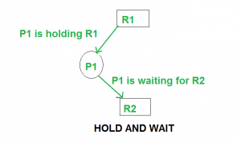
>
**Eliminate No Preemption**\
Preempt resources from the process when resources required by other
high priority processes.
>
 
>
**Eliminate Circular Wait**\
Each resource will be assigned with a numerical number. A process can
request the resources increasing/decreasing. order of numbering.\
For Example, if P1 process is allocated R5 resources, now next time if
P1 ask for R4, R3 lesser than R5 such request will not be granted,
only request for resources more than R5 will be granted.
>
 
>
 
>
**Deadlock Avoidance**
>
Deadlock avoidance can be done with Banker’s Algorithm.
>
**Banker’s Algorithm**
>
Bankers’s Algorithm is resource allocation and [deadlock avoidance](https://www.scaler.com/topics/operating-system/deadlock-avoidance-in-os/)
algorithm which test all the request made by processes for resources,
it checks for the safe state, if after granting request system remains
in the safe state it allows the request and if there is no safe state
it doesn’t allow the request made by the process.
>
**Inputs to Banker’s Algorithm:**

1.  Max need of resources by each process.

2.  Currently allocated resources by each process.

3.  Max free available resources in the system.

**The request will only be granted under the below condition:**

1.  If the request made by the process is less than equal to max need to
    that process.

2.  If the request made by the process is less than equal to the freely
    available resource in the system.

**Example:**
>
Total resources in system:
>
A B C D
>
6 5 7 6
>
Available system resources are:
>
A B C D
>
3 1 1 2
>
Processes (currently allocated resources):
>
A B C D
>
P1 1 2 2 1
>
P2 1 0 3 3
>
P3 1 2 1 0
>
Processes (maximum resources):
>
A B C D
>
P1 3 3 2 2
>
P2 1 2 3 4
>
P3 1 3 5 0
>
Need = maximum resources - currently allocated resources.
>
Processes (need resources):
>
A B C D
>
P1 2 1 0 1
>
P2 0 2 0 1
>
P3 0 1 4 0
>
**Note:** Deadlock prevention is more strict that Deadlock Avoidance.

1.  [***Deadlock detection and
    recovery***](https://www.geeksforgeeks.org/deadlock-detection-recovery/) :
    Let deadlock occur, then do preemption to handle it once occurred.

**Deadlock Detection**

1.  If resources have single instance:\
    In this case for Deadlock detection we can run an algorithm to
    check for cycle in the Resource Allocation Graph. Presence of
    cycle in the graph is the sufficient condition for deadlock.\
    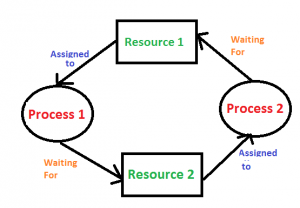

In the above diagram, resource 1 and resource 2 have single instances.
There is a cycle R1 → P1 → R2 → P2. So, Deadlock is Confirmed.

1.  If there are multiple instances of resources:\
    Detection of the cycle is necessary but not sufficient condition
    for deadlock detection, in this case, the system may or may not be
    in deadlock varies according to different situations.

**Deadlock Recovery**\
A traditional operating system such as Windows doesn’t deal with
deadlock recovery as it is time and space consuming process. Real-time
operating systems use Deadlock recovery.
>
**Recovery method**

1.  **Killing the process:** killing all the process involved in the
    deadlock. Killing process one by one. After killing each process
    check for deadlock again keep repeating the process till system
    recover from deadlock.

2.  **Resource Preemption:** Resources are preempted from the processes
    involved in the deadlock, preempted resources are allocated to
    other processes so that there is a possibility of recovering the
    system from deadlock. In this case, the system goes into
    starvation.

<!-- -->

1.  **Ignore the problem all together –** : If deadlock is very rare,
    then let it happen and reboot the system. This is the approach
    that both Windows and UNIX take.

[**Banker’s
Algorithm:**](https://www.geeksforgeeks.org/operating-system-bankers-algorithm/)\
This algorithm handles multiple instances of the same resource.

**Memory Management:**\
These techniques allow the memory to be shared among multiple processes.

-   **Overlays –** The memory should contain only those instructions and
    data that are required at a given time.

-   **Swapping –** In multiprogramming, the instructions that have used
    the time slice are swapped out from the memory.

[**Memory Management
Techniques:**](https://www.geeksforgeeks.org/operating-system-memory-management-partition-allocation-method/)

**(a) Single Partition Allocation Schemes –**\
The memory is divided into two parts. One part is kept to be used by the
OS and the other is kept to be used by the users.

**(b) Multiple Partition Schemes –**

1.  **Fixed Partition –** The memory is divided into fixed size
    partitions.

2.  **Variable Partition –** The memory is divided into variable sized
    partitions.

Variable partition allocation schemes:

1.  **First Fit –** The arriving process is allotted the first hole of
    memory in which it fits completely.

2.  **Best Fit –** The arriving process is allotted the hole of memory
    in which it fits the best by leaving the minimum memory empty.

3.  **Worst Fit –** The arriving process is allotted the hole of memory
    in which it leaves the maximum gap.

**Note:**

-   Best fit does not necessarily give the best results for memory
    allocation.

-   The cause of external fragmentation is the condition in Fixed
    partitioning and Variable partitioning saying that entire process
    should be allocated in a contiguous memory location.
    Therefore **Paging** is used.

1.  **Paging –**\
    The physical memory is divided into equal sized frames. The main
    memory is divided into fixed size pages. The size of a physical
    memory frame is equal to the size of a virtual memory frame.

2.  **Segmentation –**\
    Segmentation is implemented to give users view of memory. The
    logical address space is a collection of segments. Segmentation
    can be implemented with or without the use of paging.

[**Page Fault:**\
](https://www.geeksforgeeks.org/operating-system-page-fault-handling/)\
A page fault is a type of interrupt, raised by the hardware when a
running program accesses a memory page that is mapped into the virtual
address space, but not loaded in physical memory.

[**Page Replacement
Algorithms:**](https://www.geeksforgeeks.org/page-replacement-algorithms-in-operating-systems/)

1.  **First In First Out (FIFO) –**\
    This is the simplest page replacement algorithm. In this
    algorithm, operating system keeps track of all pages in the memory
    in a queue, oldest page is in the front of the queue. When a page
    needs to be replaced page in the front of the queue is selected
    for removal.

For example, consider page reference string 1, 3, 0, 3, 5, 6 and 3
page slots. Initially, all slots are empty, so when 1, 3, 0 came they
are allocated to the empty slots —> 3 Page Faults. When 3 comes, it
is already in  memory so —> 0 Page Faults. Then 5 comes, it is not
available in  memory so it replaces the oldest page slot i.e 1. —>
1 Page Fault. Finally, 6 comes,  it is also not available in memory so
it replaces the oldest page slot i.e 3 —> 1 Page Fault.
>
**Belady’s anomaly:**\
Belady’s anomaly proves that it is possible to have more page faults
when increasing the number of page frames while using the First in
First Out (FIFO) page replacement algorithm.  For example, if we
consider reference string      3     2     1     0     3     2     4
    3     2     1     0     4 and 3 slots, we get 9 total page faults,
but if we increase slots to 4, we get 10 page faults.

1.  **Optimal Page replacement –**\
    In this algorithm, pages are replaced which are not used for the
    longest duration of time in the future.

Let us consider page reference string 7 0 1 2 0 3 0 4 2 3 0 3 2 and 4
page slots. Initially, all slots are empty, so when 7 0 1 2 are
allocated to the empty slots —> 4 Page faults. 0 is already there
so —> 0 Page fault. When 3 came it will take the place of 7 because
it is not used for the longest duration of time in the future.—> 1
Page fault. 0 is already there so —> 0 Page fault. 4 will takes
place of 1 —> 1 Page Fault. Now for the further page reference
string —> 0 Page fault because they are already available in the
memory.
>
Optimal page replacement is perfect, but not possible in practice as
an operating system cannot know future requests. The use of Optimal
Page replacement is to set up a benchmark so that other replacement
algorithms can be analyzed against it.

1.  **Least Recently Used (LRU) –**\
    In this algorithm, the page will be replaced which is least
    recently used.

Let say the page reference string 7 0 1 2 0 3 0 4 2 3 0 3 2 .
Initially, we have 4-page slots empty. Initially, all slots are empty,
so when 7 0 1 2 are allocated to the empty slots —> 4 Page faults.
0 is already their so —> 0 Page fault. When 3 came it will take the
place of 7 because it is least recently used —> 1 Page fault. 0 is
already in memory so —> 0 Page fault. 4 will takes place of 1 —>
1 Page Fault. Now for the further page reference string —>**0 Page
fault** because they are already available in the memory. 


[**File
System**](https://www.geeksforgeeks.org/file-system-operating-systems/):
A file is a collection of related information that is recorded on
secondary storage. Or file is a collection of logically related
entities.
>
[**File
Directories**](https://www.geeksforgeeks.org/file-system-operating-systems/):
Collection of files is a file directory. The directory contains
information about the files, including attributes, location and
ownership. Much of this information, especially that is concerned with
storage, is managed by the operating system.

1.  **SINGLE-LEVEL DIRECTORY**: In this a single directory is maintained
    for all the users

2.  **TWO-LEVEL DIRECTORY**: Due to two levels there is a path name for
    every file to locate that file.

3.  **TREE-STRUCTURED DIRECTORY**: Directory is maintained in the form
    of a tree. Searching is efficient and also there is grouping
    capability.

 
>
[**File Allocation
Methods**](https://www.geeksforgeeks.org/file-system-operating-systems/):

1.  **Continuous Allocation**: A single continuous set of blocks is
    allocated to a file at the time of file creation.

2.  **Linked Allocation(Non-contiguous allocation)**: Allocation is on
    an individual block basis. Each block contains a pointer to the
    next block in the chain.

3.  **Indexed Allocation**: It addresses many of the problems of
    contiguous and chained allocation. In this case, the file
    allocation table contains a separate one-level index for each file

 
>
[**Disk
Scheduling**](https://www.geeksforgeeks.org/disk-scheduling-algorithms/):\
Disk scheduling is done by operating systems to schedule I/O requests
arriving for disk. Disk scheduling is also known as I/O scheduling.

1.  **Seek Time:** Seek time is the time taken to locate the disk arm to
    a specified track where the data is to be read or write.

2.  **Rotational Latency:** Rotational Latency is the time taken by the
    desired sector of disk to rotate into a position so that it can
    access the read/write heads.

3.  **Transfer Time:** Transfer time is the time to transfer the data.
    It depends on the rotating speed of the disk and number of bytes
    to be transferred.

4.  **Disk Access Time:** Seek Time + Rotational Latency + Transfer Time

5.  **Disk Response Time:** Response Time is the average of time spent
    by a request waiting to perform its I/O operation. Average
    Response time is the response time of the all requests.

 
>
[**Disk Scheduling
Algorithms**](https://www.geeksforgeeks.org/disk-scheduling-algorithms/):

1.  **FCFS:** FCFS is the simplest of all the Disk Scheduling
    Algorithms. In FCFS, the requests are addressed in the order they
    arrive in the disk queue.

2.  **SSTF: **In SSTF (Shortest Seek Time First), requests having
    shortest seek time are executed first. So, the seek time of every
    request is calculated in advance in a queue and then they are
    scheduled according to their calculated seek time. As a result,
    the request near the disk arm will get executed first.

3.  **SCAN:** In SCAN algorithm the disk arm moves into a particular
    direction and services the requests coming in its path and after
    reaching the end of the disk, it reverses its direction and again
    services the request arriving in its path. So, this algorithm
    works like an elevator and hence also known as elevator algorithm.

4.  **CSCAN:** In SCAN algorithm, the disk arm again scans the path that
    has been scanned, after reversing its direction. So, it may be
    possible that too many requests are waiting at the other end or
    there may be zero or few requests pending at the scanned area.

5.  **LOOK:** It is similar to the SCAN disk scheduling algorithm except
    for the difference that the disk arm in spite of going to the end
    of the disk goes only to the last request to be serviced in front
    of the head and then reverses its direction from there only. Thus
    it prevents the extra delay which occurred due to unnecessary
    traversal to the end of the disk.

6.  **CLOOK:** As LOOK is similar to SCAN algorithm, in a similar way,
    CLOOK is similar to CSCAN disk scheduling algorithm. In CLOOK, the
    disk arm in spite of going to the end goes only to the last
    request to be serviced in front of the head and then from there
    goes to the other end’s last request. Thus, it also prevents the
    extra delay which occurred due to unnecessary traversal to the end
    of the disk.

## Compiler Design

[**Phases of
Compiler**](https://www.geeksforgeeks.org/compiler-design-phases-compiler/):\
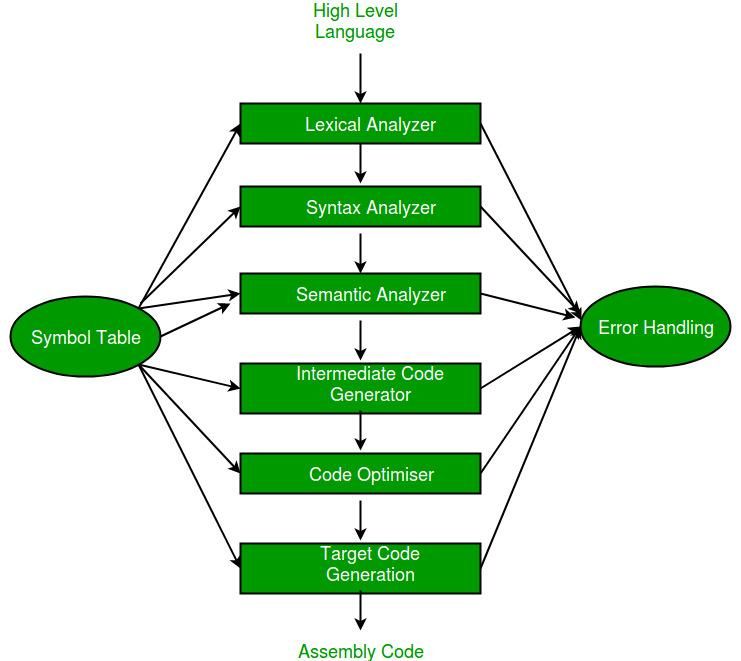

[**Symbol
Table**](https://www.geeksforgeeks.org/symbol-table-compiler/) : It is a
data structure being used and maintained by the compiler, consists all
the identifier’s name along with their types. It helps the compiler to
function smoothly by finding the identifiers quickly.

1.  **Lexical Analysis** : Lexical analyzer reads a source program
    character by character to produce tokens. Tokens can be
    identifiers, keywords, operators, separators etc.

2.  **Syntax Analysis** : Syntax analyzer is also known as parser. It
    constructs the parse tree. It takes all the tokens one by one and
    uses Context Free Grammar to construct the parse tree.

3.  **Semantic Analyzer** : It verifies the parse tree, whether it’s
    meaningful or not. It furthermore produces a verified parse tree.

4.  **Intermediate Code Generator **: It generates intermediate code,
    that is a form which can be readily executed by machine We have
    many popular intermediate codes.

5.  **Code Optimizer** : It transforms the code so that it consumes
    fewer resources and produces more speed.

6.  **Target Code Generator** : The main purpose of Target Code
    generator is to write a code that the machine can understand. The
    output is dependent on the type of assembler.

[**Error
handling**](https://www.geeksforgeeks.org/error-handling-compiler-design/) :\
The tasks of the Error Handling process are to detect each error, report
it to the user, and then make some recover strategy and implement them
to handle error. An Error is the blank entries in the symbol table.
There are two types of error :

**Run-Time Error** : A run-time error is an error which takes place
during the execution of a program, and usually happens because of
adverse system parameters or invalid input data.

**Compile-Time Error**: Compile-time errors rises at compile time,
before execution of the program.

1.  **Lexical :**This includes misspellings of identifiers, keywords or
    operators.

2.  **Syntactical :**missing semicolon or unbalanced parenthesis.

3.  **Semantical :**incompatible value assignment or type mismatches
    between operator and operand.

4.  **Logical :**code not reachable, infinite loop.

**Left Recursion** : The grammar : A -> Aa | a is left recursive. Top
down parsing techniques cannot handle left recursive grammar so we
convert left recursion into right recursion.\
Left recursion elimination : A -> Aa | a ⇒ A -> aA’\
A’ -> aA’ | a

**Left Factoring** : If a grammar has common prefixes in r.h.s of
nonterminal then suh grammar needs to be left factored by eliminating
common prefixes as follows :\
A -> ab1 | ac2 ⇒ A -> A -> aA’\
A’ -> A -> b1 | c2

[**FIRST(A)**](https://www.geeksforgeeks.org/compiler-design-first-in-syntax-analysis/) is
a set of the terminal symbols which occur as first symbols in string
derived from A

[**FOLLOW(A)**](https://www.geeksforgeeks.org/compiler-design-follow-set-in-syntax-analysis/) is
the set of terminals which occur immediately after the nonterminal A in
the strings derived from the starting symbol.


**LL(1) Parser** : LL(1) grammar is unambiguous, left factored and non
left recursive.\
To check whether a grammar is LL(1) or not :\
1. If A -> B1 | C2 ⇒ { FIRST(B1) ∩ FIRST(C2 ) = φ }\
2. If A -> B | ∈ ⇒ { FIRST(B) ∩ FOLLOW(A) = φ }

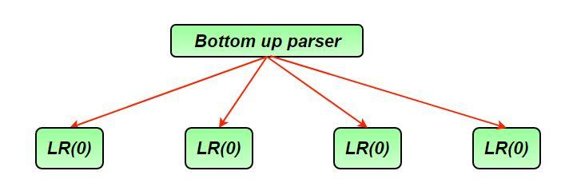

**LR(0) Parser** : Closure() and goto() functions are used to create
canonical collection of LR items.\
Conflicts in LR(0) parser :

1. **Shift Reduce (SR) conflict :** when the same state in DFA contains
both shift and reduce items. A -> B . xC (shifting) B -> a.
(reduced)

2. **Reduced Reduced (RR) conflict :** two reductions in same state of
DFA A -> a. (reduced) B -> b. (reduced)

**SLR Parser **: It is powerful than LR(0).\
Ever LR(0) is SLR but every SLR need not be LR(0).\
Conflicts in SLR\
1. SR conflict : A -> B . xC (shifting) B -> a. (reduced) if
FOLLOW(B) ∩ {x} ≠ φ\
2. RR conflict : A -> a. (reduced) B -> b. (reduced) if FOLLOW(A)
∩ FOLLOW(B) ≠ φ

**CLR Parser** : It is same as SLR parser except that the reduced
entries in CLR parsing table go only in the FOLLOW of the l.h.s
nonterminal.

**LALR Parser** : It is constructed from CLR parser, if two states
having same productions but may contain different lookaheads, those two
states of CLR are combined into single state in LALR.\
Every LALR grammar is CLR but every CLR grammar need not be LALR.\
**\
Parsers Comparison :**\
LR(0) ⊂ SLR ⊂ LALR ⊂ CLR\
LL(1) ⊂ LALR ⊂ CLR\
If number of states LR(0) = n1, number of states SLR = n2, number of
states LALR = n3, number of states CLR = n4 then, n1 = n2 = n3 <= n4

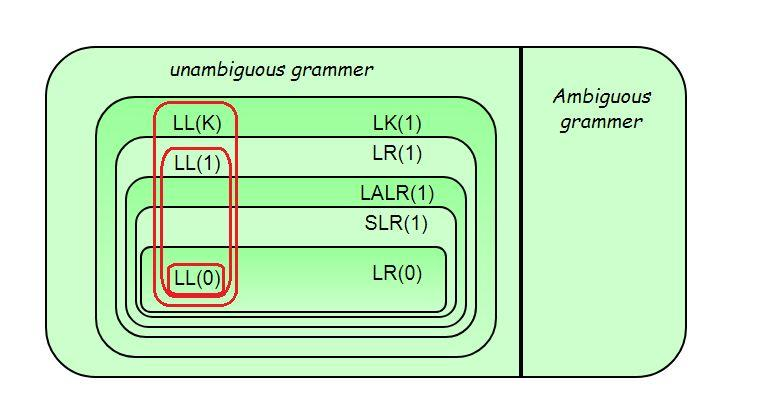

[**Syntax Directed
Translation**](https://www.geeksforgeeks.org/compiler-design-syntax-directed-translation/):
Syntax Directed Translation are augmented rules to the grammar that
facilitate semantic analysis.\
Eg – S -> AB {print (*)}\
A -> a {print (1)}\
B -> b {print (2)}

**Synthesized Attribute**: attribute whose value is evaluated in terms
of attribute values of its children.

**Inherited Attribute** : attribute whose value is evaluated in terms of
attribute values of siblings or parents.

[**S-attributed
SDT**](https://www.geeksforgeeks.org/s-attributed-and-l-attributed-sdts-in-syntax-directed-translation/):
If an SDT uses only synthesized attributes, it is called as S-attributed
SDT. S-attributed SDTs are evaluated in bottom-up parsing, as the values
of the parent nodes depend upon the values of the child nodes.

[**L-attributed
SDT**](https://www.geeksforgeeks.org/s-attributed-and-l-attributed-sdts-in-syntax-directed-translation/):
If an SDT uses either synthesized attributes or inherited attributes
with a restriction that it can inherit values from left siblings only,
it is called as L-attributed SDT. Attributes in L-attributed SDTs are
evaluated by depth-first and left-to-right parsing manner.

**Activation Record **: Information needed by a single execution of a
procedure is managed using a contiguous block of storage called
activation record. An activation record is allocated when a procedure is
entered and it is deallocated when that procedure is exited.

[**Intermediate
Code**](https://www.geeksforgeeks.org/intermediate-code-generation-in-compiler-design/):
They are machine independent codes. Syntax trees, postfix notation,
3-address codes can be used to represent intermediate code.

[**Three address
code**](https://www.geeksforgeeks.org/three-address-code-compiler/):
1. Quadruples (4 fields : operator, operand1, operand2, result)\
2. Triplets (3 fields : operator, operand1, operand2)\
3. Indirect triples

[**Code
Optimization**](https://www.geeksforgeeks.org/compiler-design-code-optimization/):

Types of machine independent optimizations –\
1. **Loop optimizations** :

-   Code motion : reduce the evaluation frequency of expression.

-   Loop unrolling : to execute less number of iterations

-   Loop jamming : combine body of two loops whenever they are sharing
    same index.

2. **Constant folding** : replacing the value of constants during
compilation\
3. **Constant propagation** : replacing the value of an expression
during compile time.\
4. **Strength reduction** : replacing costly operators by simple
operators.

## System Design

Design Scalable System like Instagram
=====================================

**1- WHAT IS INSTAGRAM?**

Instagram is one of the best social media platforms in today’s world.
Most of the people use the Instagram every day effectively and
continuously. This causes that Instagram is under heavy-traffic. As you
know, heavy-traffic means that there are too many incoming requests to
the system and system should respond all these requests under
reliability, availability and minimum latency.

As you know Instagram is a social media platform that ensures users to
upload, share, view, comment pictures via this platform. Additionally,
you can follow other users. If you are using Instagram, you can realize
that user’s timeline is one the best and important topic for Instagram
because every user meet this system in its timeline and timeline
creation time is so important under this conditions.

**2- REQUIREMENTS AND GOALS OF THE SYSTEM**

As you know, if you need to design your design carefully, you should
focus three requirement topics which are functional, nonfunctional,
extended requirements.

**a-) Functional Requirements**

   – Users can register the system.\
   – Users can log in and log out the system.\
   – Users can share, download, view pictures of their pictures or other
user’s pictures.\
   – Users can follow other users.\
   – Users can share (upload) pictures when they register and log into
the system.\
   – Users can view (download) pictures when other users allow that
their pictures can be viewed publicly.\
   – Users can view hottest pictures in their timeline.\
   – Users can search pictures based on titles.

**b-) Nonfunctional Requirements**

   – The system should be highly available.\
   – The system should be highly reliable. As we said, users can upload
pictures and all data of users should not be lost.\
   – The system can work based on CAP Theorem. If we talk about a system
like Instagram. Transaction operations are not as important as financial
operations. This means that consistency can take time. This is
sufficient if the system will be consistent within a certain period of
time. Availability is more important than consistency so a user may not
see photo for a while, this is fine.

  As we said, timeline creation process is one of the hardest and
important points of the Instagram design. This is good if the optimum
time for creation timeline is 250 ms.

**c-) Extended Requirements**

   – The system should monitor.\
   – The creation of timeline needs to effective algorithms for
decreasing time.\
   – We can realize that this system is read-heavy so we should focus on
the uploading and present pictures, so reliability and minimum latency
are two main points of consideration.

   Note: Instagram is a huge system and I didn’t deal with the comment
process, recommendations and tags. Recommendation systems are another
important system that it should be designed carefully.

**3- CAPACITY AND ESTIMATION**

When we talk about the define capacity and estimation we should think
the future of the system. To illustrate this, we can deal with the data
that collect up to 5 or 10 years. It helps us to scale easily. Let’s
assume the total user count of Instagram is 500 Million and the daily
user is 10 Million. If we assume that each user uploads 2 picture in
each day, daily incoming picture count is 20 Million. Notice that we can
think the average size of the picture is 500 KB so total required space
for 1 day is 20 Million * 500 KB = 10 * 10\^12 = 10 TB. Total space
required for 5 years can easily be estimated. Note that, this capacity
doesn’t contain replicate data. Additionally, we should just only use
until 80% of total existing capacity.

**4- API DESIGN**

We can use REST or SOAP to server our APIs. Basically, there are three
important API of our system.

   1-) *UploadPicture (api\_dev\_key, picture, title,
picture\_description, tags\[\], picture\_details)*\
     UploadPicture base on the uploading picture. api\_dev\_key is the
API developer key of a registered account. We can eliminate hacker
attacks with api\_dev\_key. This API returns HTTP response. (202
accepted if success)

   2-) *DownloadPicture (api\_dev\_key, search\_query, user\_location,
maximum\_video\_count, page\_token)*\
     Return JSON containing information about the list of pictures. Each
picture resource will have a picture title, creation date, like count,
dislike count, total view count.

   3-) *DeletePicture (api\_dev\_key, pictureID)*\
     Return HTTP response if success.

**There are a lot of another APIs to design Instagram, however, these
three APIs are more important than the others.

**5- DATABASE SCHEMA**

As you know, we have talked about the pictures and users basically. We
have to decide whether to use SQL or NoSQL before defining database
tables. We can use RDBMS to keep data but as you know, scale process of
a traditional database system is hard when we decide to keep data o a
traditional database system. On the other hand, if we use NoSQL, we can
scale system easily. There are three tables to store data;

   **User**\
    – UserID : Int\
    – UserName : Nvarchar\
    – UserRealName : Nvarchar\
    – UserSurname : Nvarchar\
    – Mail : Nvarchar\
    – BirthDate : DateTime\
    – RegisterDate : DateTime\
    – LastLoginDate: DateTime

   **Picture**\
    – PictureID : Int\
    – UserID : Int\
    – PicturePath : Nvarchar\
    – PictureLatitude : Int\
    – PictureLongitude : Int\
    – CreationDate : DateTime

   **UserFollow**\
    – UserID1 : Int\
    – UserID2 : Int

   ** If we choose the NoSQL to keep data, we need to add a new table
system. (PictureUser)\
   ** We can store photos in S3 or HDFS.\
   ** We can store all information about pictures with a key-value
pair like Redis. Key is pictureID, a value is other information about
the picture. (For NoSQL)\
   ** We can store all information about users with a key-value pair
like Redis. Key is userID, a value is other information about the user.
(For NoSQL)\
   ** We can use Cassandra, column-based data storage, to save
follow-up of users.

   Note: A lot of NoSQL database supports replication.

   Note: We need to have an index on PictureID and CreationDate because
we need to get hottest pictures.

**6- COMPONENT DESIGN**

We can realize that uploading and downloading operation are not same.
Uploading operation is slower than downloading operation because
uploading operation just based on disk. On the other hand, read
operation could be faster if we are using a cache.

If a user tries to upload a picture, he/she can consume all the
connections. This causes to when uploading operation continues, the
system may not respond to read operation. If we divide uploading and
downloading operations into two separate services, then we can handle
this bottleneck. Notice that, web servers have connection limits at any
time and we need to focus on this point. Notice that, separating of
uploading and downloading operations ensure that system can be more
scalable and optimize.

**7- HIGH-LEVEL SYSTEM DESIGN**

If we are designing a system, the basic concepts we need are;

   – Client\
   – Services\
   – Web server\
   – Application server\
   – Picture Storage\
   – Database\
   – Caching\
   – Replication\
   – Redundancy\
   – Load balancing\
   – Sharding

There are two separate services in this system, which are upload image
and download image. Picture storage is used to keep pictures. A database
is used to save all information about users and pictures. (metadata).
When a request comes to the system, the first to meet request is the web
servers. Web servers redirect an incoming request to application
servers.

**8- REPLICATION AND REDUNDANCY**

Replication is a very important concept to provide availability and
reliability. As we said, Instagram should ensure that any files cannot
be lost. Replication is a very important concept to handle a failure of
services or servers. Replication and redundancy basically mean the copy
of services or servers. We can replicate database servers, web servers,
application servers, image storages and etc.. Actually we can replicate
all parts of the system. Notice that replication also helps system to
decrease response time. You imagine, if we divide incoming requests into
more resources rather than one resource, the system can easily meet all
incoming requests. In addition, the optimum number of a replica to each
resource is 3 or more. Thanks to replications, if any server dies, the
system continues to respond via secondary resource.

**9- DATA SHARDING**

As you know, sharding is a very important concept which helps system to
keep data into different resources according to sharding process. There
can be two sharding procedure to use. First is partitioning based on
UserID and second is partitioning based on PhotoID.

Partitioning based on UserID: We can divide incoming requests based on
UserID. We will find the shard number by UserID % number of shards.
Conditioning with shard based on UserID causes to problems. First is
that system may be non-uniform distributed and second is if a user is
more active than the other user, the data of this user may not be fitted
into one resource. Another possible problem is handling the PictureID
creation. PictureID should be unique in the system, so each shard needs
to have its creation policy.\
Partitioning based on PictureID: We can divide incoming requests based
on PictureID. We will find the shard number by PictureID% number of
shards. We can handle the non-uniform distribution problem and popular
user problem. We can easily create PhotoID with Key Generation Service.
Key Generation Service creates unique identifiers at first then serve
this unique identifier to incoming pictures. This helps us to handle
PhotoID problem.

**10- CACHING**

Cache memory is a crucial part of reading data faster. Cache memory
usage can base on 80-20 rule. This means that cache capacity is the 20%
of the daily data size. We can use LRU cache policy (Least Recently
Used).

   -CDN: CDN, Content Delivery Network is for distributed file cache
servers. We can usage CDN for keeping pictures.\
   -Memcache / Redis: Keep metadata in the cache with Memcache or Redis.

**11- LOAD BALANCING**

Load balancer allows incoming requests to be redirected to resources
according to certain criteria. We can use load balancer at every layer
of the system.

   – Between requests and web servers.\
   – Between web servers and application servers.\
   – Between application servers and databases\
   – Between application servers and image storages.\
   – Between application servers and cache databases.\
   – We can use Round Robin method for the load balancer. Round Robin
method prevents requests from going to dead servers but Round Robin
method doesn’t deal with the situation that any server is under
heavy-traffic. We can modify Round Robin method to be a more intelligent
method to handle this problem.

**12- DESIGN CONSIDERATION**

Notice that we need to get the popular, latest and relevant photos of
other people that we follow. We can use a pre-generate timeline to
decrease latency because you image that system will fetch all friends of
us firstly then fetch all pictures of our friends. After that, the
system will combine all pictures based on creation time, like count or
other properties. This action can take time and causes to late response.
Pre-generate timeline keeps users’ timelines into a table previously.
Thanks to the pre-generate timeline, the system can serve them without
the hassle of processing when they need to. What needs to be discussed
here is what to do when new data comes in. There are three important
methods we can mention,

   – Pull: The client asks if there are any changes at regular
intervals. This creates some problems. To illustrate this, we may not
get new data when we use the system. Another problem is most of the
type, the client can encounter with the empty response.

   – Push: In push method, a server can push new data to clients as soon
as it is available. Long Polling is one the best methods to use this
method efficiently. Long polling is a method that there is an open
connection between the client and the server, and if any change occurs
about data, server return response to the client as soon as possible.
This method may cause a problem for users that follow a lot of users.

   – Hybrid: Hybrid method is a combination of pull and push methods.
Push method is for users that follow few users and pull method is for
users that follow a lot of users.

  ```java
  // Java Program to explain the design
  
    
  
  public class Server{
  
      ArrayList<Machine> machines = new ArrayList<Machine>();
  
  }
  
  public class Storage{
  
      ArrayList<StorageMachine> machines = new ArrayList<StorageMachine>();
  
  }
  
  public class Machine{
  
      public ArrayList<User> users = new ArrayList<User>();
  
      public int machineID;
  
  }
  
  public class StorageMachine{
  
      public ArrayList<Picture> pictures = new ArrayList<Picture>();
  
      public int machineID;
  
  }
  
  public class User{
  
      private ArrayList<Integer> friends;
  
      private ArrayList<Integer> pictures;
  
      private int userID;
  
      private int machineID;
  
      private String information;
  
      private Server server = new Server();
  
      private Storage storage = new Storage();
  
     
  
      public User(int userID, int machineID){
  
          this.userID = userID;
  
          this.machineID = machineID;
  
  pictures = new ArrayList<Integer>();
  
  friends = new ArrayList<Integer>();
  
      }
  
     
  
      public String getInformation() {
  
          return information;
  
      }
  
     
  
      public void setInformation(String information){
  
          this.information = information;
  
      }
  
     
  
      public getID(){
  
          return userID;
  
      }
  
     
  
      public int getMachineID(){
  
          return machineID;
  
      }
  
     
  
      public void addFriend(int id){
  
          friends.add(i);
  
      }
  
     
  
      public void addPicture(int id){
  
          pictures.add(i);
  
      }
  
     
  
      public int\[\] getFriends(){
  
          int\[\] temp = new int\[friends.size()\];
  
          for(int i=0; i<temp.length; i++){
  
              temp\[i\] = friends.get(i);
  
          }
  
          return temp;
  
      }
  
     
  
      public int\[\] getPictures(){
  
          int\[\] temp = new int\[pictures.size()\];
  
          for(int i=0; i<temp.length; i++){
  
              temp\[i\] = pictures.get(i);
  
          }
  
          return temp;
  
      }
  
     
  
      public User lookUpFriend(int machineID, int ID){
  
          for(Machine m : server.machine){
  
              if(m.machineID  = machineID){
  
                  for(User user : m.users){
  
                      if(user.userID = ID){
  
                          return user;
  
                      }
  
                  }
  
              }
  
          }
  
          return null;
  
      }   
  
     
  
      public Picture lookUpPicture(int machineID, int ID){
  
          for(StorageMachine m : storage.machine){
  
              if(m.machineID  = machineID){
  
                  for(Picture picture : m.pictures){
  
                      if(picture.pictureID = ID){
  
                          return picture;
  
                      }
  
                  }
  
              }
  
          }
  
          return null;
  
      }
  
  }
  
  public class Picture{
  
      private int machineID;
  
      private int pictureID;
  
      private String photoPath;
  
     
  
      public Picture(int machineID, int pictureID, String photoPath){
  
          this.machineID = machineID;
  
          this.pictureID = pictureID;
  
          this.photoPath = photoPath;
  
      }
  
     
  
      public int getMachineID(){
  
          return machineID;
  
      }
  
     
  
      public void setMachineID(int machineID){
  
          this.machineID = machineID;
  
      }
  
     
  
      public int getPictureID(){
  
          return pictureID;
  
      }
  
     
  
      public int getPhotoPath(){
  
          return photoPath;
  
      }
  
     
  
      public void setPhotoPath(String photoPath){
  
          this.photoPath = photoPath;
  
      }
  
  }
  ```
Source: [GeeksForGeeks](http://www.geeksforgeeks.org/)
